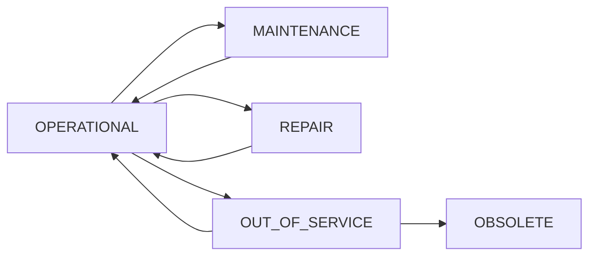

## Overview

Energy CMMS provides a comprehensive hierarchical asset management system that allows you to organize, track, and manage all physical assets across your facilities.

## Asset Hierarchy

Assets are organized in a parent-child relationship structure:

- **Top-level Assets**: Main equipment or systems
- **Components**: Sub-assets that belong to a parent asset
- **Categories**: Classify assets by type (Electrical, Mechanical, HVAC, etc.)
- **Locations**: Physical placement within hierarchical locations

## Creating Assets

<Steps>
  <Step title="Navigate to Assets">
    Go to **Assets > Assets** in the admin panel
  </Step>
  
  <Step title="Add New Asset">
    Click **"Add Asset"** button in the top right
  </Step>
  
  <Step title="Fill Basic Information">
    - **Name**: Descriptive name for the asset
    - **Internal Code**: Unique identifier (optional)
    - **Serial Number**: Manufacturer's serial number
    - **Model**: Select from existing models or create new
  </Step>
  
  <Step title="Set Location and Hierarchy">
    - **Location**: Select hierarchical location
    - **Parent Asset**: If this is a component, select parent
    - **Category**: Classification (auto-filled from model)
  </Step>
  
  <Step title="Additional Details">
    - **Status**: OPERATIONAL, MAINTENANCE, REPAIR, OUT_OF_SERVICE, OBSOLETE
    - **Purchase Date**: Date of acquisition
    - **Cost**: Purchase or replacement cost
    - **Responsible**: Assigned person
  </Step>
</Steps>

<Note>
  Assets inherit properties from their **Model**, which links to a **Category**. This cascading structure ensures consistent maintenance routines.
</Note>

## Asset Search and Filtering

### Quick Search

Use the search bar to find assets by:
- Name
- Internal code
- Serial number
- Description
- Location name

### Advanced Filtering

Filter assets using:
- **Category**: Filter by asset type
- **Location**: Hierarchical location filter
- **Status**: Current operational status
- **Family**: Group related assets
- **Manufacturer/Model**: Brand and model filters

```python
# Example: Filter assets in specific location hierarchy
activos = Activo.objects.filter(
    ubicacion__in=ubicacion.get_descendants(include_self=True)
).select_related('modelo__categoria', 'ubicacion')
```

## Hierarchical Explorer

<Tip>
  Use the **Hierarchical Explorer** (tree view) to navigate complex asset structures efficiently.
</Tip>

The explorer provides:
- **Location-based navigation**: Browse assets by physical location
- **Category-based navigation**: Browse by equipment type
- **Quick asset details**: Click any asset to view information
- **Bulk selection**: Select multiple assets for operations

### Navigation Modes

<Tabs>
  <Tab title="By Location">
    Navigate through your facility hierarchy:
    1. Start at root locations (Buildings, Sites)
    2. Expand sub-locations (Floors, Rooms)
    3. View assets within each location
    4. Components appear nested under parent assets
  </Tab>
  
  <Tab title="By Category">
    Browse by equipment type:
    1. Select top-level category (Electrical, Mechanical)
    2. Drill down to subcategories (Motors, Pumps)
    3. View all assets of that type
    4. Filter by location if needed
  </Tab>
</Tabs>

## Asset Components

For complex equipment, create hierarchical component structures:

<Steps>
  <Step title="Create Parent Asset">
    Create the main equipment (e.g., "Generator Set #1")
  </Step>
  
  <Step title="Add Components">
    Create child assets with **Parent Asset** field set:
    - Engine
    - Alternator
    - Control Panel
    - Cooling System
  </Step>
  
  <Step title="Configure Maintenance">
    Assign specific maintenance routines to each component
  </Step>
</Steps>

<Warning>
  Deleting a parent asset will also delete all child components. This action cannot be undone.
</Warning>

## Asset Details and History

Each asset provides comprehensive tracking:

### Work History
```python
# Recent work orders for an asset
ots_recientes = activo.ordenes_trabajo.all()
    .order_by('-inicio_programado')[:10]
```

### Maintenance Records
- **Preventive Maintenance**: Scheduled routines
- **Corrective Maintenance**: Repairs from notifications
- **Service History**: Timeline of all interventions

### Associated Data
- **Measurement Points**: Sensors and monitoring points
- **Documents**: Manuals, drawings, certificates
- **Photos**: Visual documentation
- **QR Codes**: Mobile access links

## Asset Status Workflow

Assets transition through operational states:



<Info>
  Status changes can trigger automatic notifications to responsible personnel.
</Info>

## Floor Plans and Visualization

### Interactive Plans

Pin assets to floor plans for visual navigation:

<Steps>
  <Step title="Upload Plan">
    Go to **Assets > Floor Plans**, upload facility drawing
  </Step>
  
  <Step title="Create Viewer">
    Link plan to location, create interactive viewer
  </Step>
  
  <Step title="Pin Assets">
    Click on plan to place pins, link to assets
  </Step>
  
  <Step title="Add Metadata">
    Include notes, photos, and status indicators
  </Step>
</Steps>

### Pin Types
- **Asset Pins**: Direct link to equipment
- **Notification Pins**: Active issues or alerts
- **Project Pins**: Construction/modification activities
- **Zone Pins**: Area boundaries and labels

## Bulk Import/Export

### Export Assets

<Tabs>
  <Tab title="Excel Export">
    1. Select assets to export (or use filters)
    2. Click **"⬇️ Direct Excel Download"**
    3. File includes all fields for editing
  </Tab>
  
  <Tab title="CSV Streaming">
    For large datasets (85,000+ records):
    1. Use **"⚡ CSV Streaming Export"**
    2. Optimized for memory efficiency
    3. Pre-calculates location paths to avoid N+1 queries
  </Tab>
</Tabs>

### Import Assets

<Warning>
  Always export a sample first to understand the exact column structure.
</Warning>

**Required Columns:**
- `nombre`: Asset name
- `modelo_nombre`: Model name (creates if doesn't exist)
- `marca_nombre`: Manufacturer name

**Optional Columns:**
- `codigo_interno`: Internal code
- `serie`: Serial number
- `ubicacion_nombre`: Location path (e.g., "Building A → Floor 2 → Room 205")
- `estado`: Status (OPERATIVO, MANTENIMIENTO, etc.)
- `padre_nombre`: Parent asset name (for components)
- `costo`: Cost
- `fecha_compra`: Purchase date (YYYY-MM-DD)

```csv
nombre,modelo_nombre,marca_nombre,ubicacion_nombre,serie,estado
"Motor Pump #1","500HP Centrifugal","KSB","Plant → Pump Room","KSB2024-001","OPERATIVO"
"Transformer T1","1000KVA Dry Type","ABB","Substation A","ABB-TX-445","OPERATIVO"
```

## Asset Relationships

### Compatibility Matrix

Link spare parts and materials to compatible models:

```python
# Define compatible materials for a model
compatibilidad = CompatibilidadMaterial.objects.create(
    modelo=modelo,
    material=material,
    cantidad_requerida=1
)
```

### Family Groups

Group similar assets for collective analysis:
- Energy meters
- Critical pumps
- Emergency generators
- HVAC units

## Mobile Access

<Tip>
  Generate QR codes for quick mobile access to asset details and work orders.
</Tip>

Mobile features:
- Scan QR code to view asset
- See recent work orders
- View maintenance history
- Access measurement points
- Submit notifications

## Best Practices

<CardGroup cols={2}>
  <Card title="Use Consistent Naming" icon="signature">
    Establish naming conventions:
    - Include location codes
    - Use sequential numbering
    - Indicate asset type
  </Card>
  
  <Card title="Link to Models" icon="link">
    Always assign a Model:
    - Enables automatic routine assignment
    - Standardizes spare parts
    - Facilitates reporting
  </Card>
  
  <Card title="Set Locations" icon="map-pin">
    Accurate location tracking:
    - Simplifies work planning
    - Enables route optimization
    - Supports audits
  </Card>
  
  <Card title="Regular Audits" icon="clipboard-check">
    Periodic verification:
    - RFID/QR scanning campaigns
    - Update missing data
    - Retire obsolete assets
  </Card>
</CardGroup>

## Common Workflows

### Register New Equipment

```python
# 1. Create or verify model exists
modelo, created = Modelo.objects.get_or_create(
    nombre="500HP Centrifugal Pump",
    marca=marca,
    defaults={'categoria': categoria}
)

# 2. Create asset instance
activo = Activo.objects.create(
    nombre="Pump P-001",
    modelo=modelo,
    ubicacion=ubicacion,
    codigo_interno="P-001",
    serie="KSB2024-001",
    estado='OPERATIVO'
)

# 3. Assign to maintenance program (automatic via category)
```

### Decommission Equipment

<Steps>
  <Step title="Update Status">
    Change status to `OUT_OF_SERVICE` or `OBSOLETE`
  </Step>
  
  <Step title="Complete Final Maintenance">
    Close any open work orders
  </Step>
  
  <Step title="Remove from Schedules">
    Cancel future preventive maintenance
  </Step>
  
  <Step title="Document Disposition">
    Add notes about disposal, sale, or storage
  </Step>
</Steps>

## Integration Points

### With Maintenance Module
- Automatic routine assignment based on category
- Work order generation for each asset
- Maintenance history tracking

### With Inventory Module
- Compatible spare parts lookup
- Material consumption tracking
- Stock alerts for critical components

### With Document Control
- Link manuals and drawings
- Certificate management
- Compliance documentation

## Reporting and Analytics

Generate insights from asset data:

- **Asset Register**: Complete inventory report
- **Depreciation Analysis**: Age and value tracking
- **Criticality Matrix**: Risk-based prioritization
- **Utilization Reports**: Operating hours and efficiency
- **Lifecycle Costs**: Total cost of ownership

---

**Next Steps:**
- [Configure Maintenance Workflows](/guides/maintenance-workflow)
- [Set Up Requisitions](/guides/requisitions)
- [Manage Work Permits](/guides/work-permits)