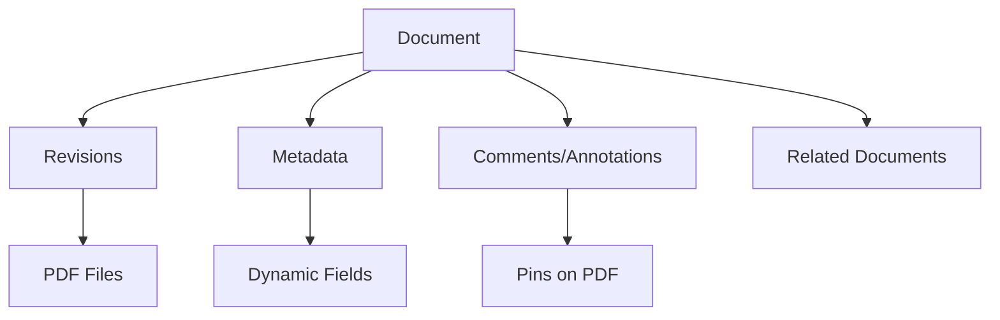
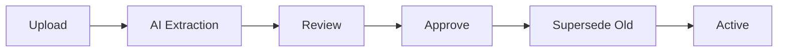
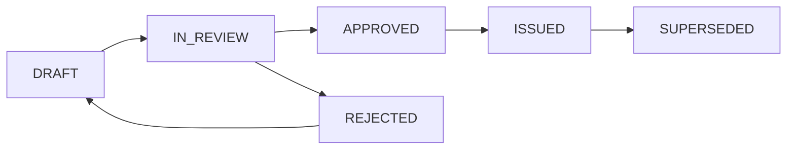

## Overview

Energy CMMS provides enterprise document control with revision management, AI-powered search, interactive PDF annotations, and full traceability.

## Document Hierarchy

Documents are organized hierarchically:



## Core Concepts

<CardGroup cols={3}>
  <Card title="Document Types" icon="folder">
    Classify documents: Drawings, Manuals, Procedures, Certificates
  </Card>
  <Card title="Disciplines" icon="sitemap">
    Technical areas: Electrical, Mechanical, Civil, HVAC
  </Card>
  <Card title="Revisions" icon="code-branch">
    Version control with automatic tracking
  </Card>
</CardGroup>

## Creating Documents

<Steps>
  <Step title="Navigate to Documents">
    Go to **Documents > Documents**
  </Step>
  
  <Step title="Add New Document">
    Click **"Add Document"** button
  </Step>
  
  <Step title="Basic Information">
    - **Code**: Unique identifier (auto-generated or manual)
    - **Title**: Descriptive name
    - **Type**: Document classification
    - **Discipline**: Technical area
  </Step>
  
  <Step title="Upload File">
    Create first revision:
    - Upload PDF file
    - Set revision number (e.g., "A", "Rev 0")
    - Add revision notes
    - System triggers AI extraction
  </Step>
  
  <Step title="Configure Metadata">
    Fill dynamic fields:
    - Fields auto-created from document type
    - Can be filled manually
    - Or auto-extracted via AI
  </Step>
</Steps>

### Document Model

```python
documento = Documento.objects.create(
    codigo="DWG-ELEC-001",
    titulo="Substation A Single Line Diagram",
    tipo_documento=electrical_drawing_type,
    disciplina=electrical_discipline,
    estado_actual='EN_REVISION',
    responsable=engineer,
    fecha_inicio=date.today()
)

# Create first revision
revision = Revision.objects.create(
    documento=documento,
    numero_revision="A",
    archivo=uploaded_pdf,
    cambios="Initial issue"
)
```

## Revision Control

### Revision Workflow



<Tabs>
  <Tab title="Creating Revisions">
    **When document changes**:
    1. Upload new PDF version
    2. Increment revision number
    3. Document what changed
    4. Previous revision marked as superseded
    5. New revision becomes current
  </Tab>
  
  <Tab title="Revision Numbering">
    **Standard schemes**:
    - **Alphabetic**: A, B, C, D...
    - **Numeric**: 0, 1, 2, 3...
    - **Combined**: Rev 0, Rev 1, Rev 2...
    - **For Construction**: For Review, For Approval, As Built
  </Tab>
  
  <Tab title="Automatic Tracking">
    **System captures**:
    - Who uploaded
    - When uploaded
    - What changed
    - File size and format
    - MD5 hash for integrity
  </Tab>
</Tabs>

### Accessing Revisions

```python
# Get current revision
current = documento.ultima_revision

# Get all revisions chronologically
historial = documento.revisiones.all().order_by('-fecha_carga')

# Compare two revisions
rev_a = documento.revisiones.get(numero_revision='A')
rev_b = documento.revisiones.get(numero_revision='B')
```

<Note>
  All revisions are retained. You can always access previous versions for audit trails or rollback.
</Note>

## AI-Powered Features

### Automatic Text Extraction

When PDF is uploaded, n8n workflow:

<Steps>
  <Step title="Upload Triggers Webhook">
    ```python
    # Django sends webhook to n8n
    payload = {
        'documento_id': doc.id,
        'filepath': revision.archivo.name,
        'callback_url': f"{settings.SITE_URL}/documentos/api/update-texto/{doc.id}/"
    }
    requests.post(settings.N8N_EXTRACT_TEXTO_WEBHOOK_URL, json=payload)
    ```
  </Step>
  
  <Step title="n8n Extracts Text">
    Workflow performs:
    - PDF to text conversion (OCR if needed)
    - Text cleanup and formatting
    - Page-by-page extraction
  </Step>
  
  <Step title="Callback with Results">
    n8n posts back:
    ```json
    {
      "documento_id": 123,
      "texto": "Full extracted text...",
      "pages": 45
    }
    ```
  </Step>
  
  <Step title="Generate Embeddings">
    Django Celery task:
    - Chunks text into fragments
    - Generates vector embeddings via Gemini
    - Stores in pgvector for semantic search
  </Step>
</Steps>

### Metadata Extraction

AI can auto-fill metadata fields:

```python
# Trigger AI metadata extraction
webhook_url = settings.N8N_METADATA_SYNC_WEBHOOK
payload = {
    'documento_id': doc.id,
    'file_url': doc.ultima_revision.archivo.url,
    'metadatos': [
        {'nombre': 'project_number', 'etiqueta': 'Project Number'},
        {'nombre': 'drawing_scale', 'etiqueta': 'Scale'},
        {'nombre': 'date_issued', 'etiqueta': 'Date Issued'}
    ]
}
response = requests.post(webhook_url, json=payload)
```

<Tip>
  AI extraction works best on structured documents like drawings with title blocks. Results may vary on handwritten or low-quality scans.
</Tip>

## Dynamic Metadata

Customize metadata per document type:

### Configuring Metadata Fields

<Steps>
  <Step title="Define Fields for Type">
    Go to **Documents > Metadata Configurations**:
    - Link to document type
    - Add field configurations
  </Step>
  
  <Step title="Field Configuration">
    For each field:
    - **Name**: Internal field name (e.g., `project_number`)
    - **Label**: Display name (e.g., "Project Number")
    - **Field Type**: TEXT, NUMBER, DATE, SELECT, BOOLEAN, RELATIONAL
    - **Required**: Mandatory for approval
    - **Order**: Display sequence
  </Step>
  
  <Step title="Relational Fields">
    Link to other models:
    - **Content Type**: Select related model (Asset, Location, etc.)
    - **Display Field**: Which field to show
    - Creates dropdown with autocomplete
  </Step>
</Steps>

### Example Metadata Config

```python
# Drawing-specific metadata
configs = [
    MetadatoConfig(
        tipo_documento=drawing_type,
        nombre='drawing_number',
        etiqueta='Drawing Number',
        tipo_campo='TEXT',
        es_requerido=True,
        orden=1
    ),
    MetadatoConfig(
        tipo_documento=drawing_type,
        nombre='scale',
        etiqueta='Scale',
        tipo_campo='SELECT',
        opciones_select='1:50,1:100,1:200,NTS',
        orden=2
    ),
    MetadatoConfig(
        tipo_documento=drawing_type,
        nombre='related_equipment',
        etiqueta='Related Equipment',
        tipo_campo='RELATIONAL',
        content_type=ContentType.objects.get_for_model(Activo),
        campo_relacional='nombre',
        orden=3
    )
]
```

## Interactive PDF Viewer

Annotate and collaborate on documents:

### Pin System

<CardGroup cols={2}>
  <Card title="Comment Pins" icon="comment">
    Add notes and discussions to specific locations on PDF
  </Card>
  <Card title="Markup Pins" icon="highlighter">
    Highlight areas for review or clarification
  </Card>
  <Card title="Issue Pins" icon="circle-exclamation">
    Flag errors or required changes
  </Card>
  <Card title="Link Pins" icon="link">
    Connect to other documents or assets
  </Card>
</CardGroup>

### Adding Annotations

<Steps>
  <Step title="Open Document Viewer">
    Click document to open interactive PDF viewer
  </Step>
  
  <Step title="Select Pin Type">
    Choose annotation type from toolbar
  </Step>
  
  <Step title="Place Pin">
    Click on PDF where comment applies:
    - Point pin: Single click
    - Area pin: Click and drag rectangle
  </Step>
  
  <Step title="Add Content">
    Fill in annotation:
    - Text comment
    - Assign to responsible person
    - Attach images
    - Link to other documents
  </Step>
</Steps>

### Pin Features

```python
comentario = ComentarioDocumento.objects.create(
    documento=doc,
    revision=current_revision,
    usuario=request.user,
    responsable=assigned_engineer,
    texto="Verify transformer rating matches spec",
    tipo='ISSUE',
    posicion_x=450.5,
    posicion_y=320.8,
    pagina=3,
    resuelto=False
)

# Attach image
ComentarioImagen.objects.create(
    comentario=comentario,
    imagen=uploaded_photo
)

# Link to related document
comentario.vinculos.add(related_spec_document)
```

<Warning>
  Pins are tied to specific revisions. When document is revised, pins from previous revisions remain visible but are marked as "from superseded revision".
</Warning>

## Document Traceability

Track document relationships and history:

### Relationship Types

<Tabs>
  <Tab title="Parent-Child">
    **Response documents**:
    - RFI responses
    - Transmittals
    - Review comments
    
    ```python
    response_doc = Documento.objects.create(
        codigo="RFI-RESP-001",
        titulo="Response to RFI-001",
        respuesta_a=original_rfi  # Parent link
    )
    ```
  </Tab>
  
  <Tab title="Cross-References">
    **Via pins**:
    - Related drawings
    - Referenced specs
    - Supporting docs
    
    Pin creates bidirectional link.
  </Tab>
  
  <Tab title="Temporal">
    **Revision history**:
    - Superseded by
    - Supersedes
    - Chronological chain
  </Tab>
</Tabs>

### Traceability View

Visualize complete document network:

```python
# Get full traceability tree
tree = build_traceability_tree(documento)

# Returns hierarchical structure:
{
    'documento': documento,
    'parent': parent_doc,
    'children': [child1, child2],
    'revisions': [rev_a, rev_b, rev_c],
    'linked_docs': [doc1, doc2]  # Via pins
}
```

<Tip>
  Use the **Traceability Viewer** to see the complete document ecosystem. Helpful for impact analysis when making changes.
</Tip>

## Search Capabilities

### Standard Search

Quick lookup by code or title:

```python
# Simple search
results = Documento.objects.filter(
    Q(codigo__icontains=query) | Q(titulo__icontains=query)
).select_related('tipo_documento', 'disciplina')[:20]
```

### Advanced Filters

Multi-criteria search:

<AccordionGroup>
  <Accordion title="By Type & Discipline" icon="filter">
    Filter combination:
    - Document type (Drawing, Manual, etc.)
    - Discipline (Electrical, Mechanical, etc.)
    - Status (Draft, Approved, Superseded)
  </Accordion>
  
  <Accordion title="Date Range" icon="calendar-range">
    Temporal filtering:
    - Created between dates
    - Modified after date
    - Issued in specific period
  </Accordion>
  
  <Accordion title="Metadata Search" icon="database">
    Dynamic field filters:
    - Project number
    - Drawing number
    - Equipment tag
    - Any configured metadata
  </Accordion>
</AccordionGroup>

### Semantic Search

AI-powered content search:

<Steps>
  <Step title="User Enters Query">
    Natural language question:
    - "transformer protection relay settings"
    - "fire pump installation procedure"
    - "electrical room ventilation requirements"
  </Step>
  
  <Step title="Generate Query Vector">
    ```python
    import google.generativeai as genai
    
    genai.configure(api_key=settings.GEMINI_API_KEY)
    result = genai.embed_content(
        model="models/text-embedding-004",
        content=query,
        task_type="retrieval_query"
    )
    query_vector = result['embedding']
    ```
  </Step>
  
  <Step title="Search Vector Database">
    Find similar document fragments:
    ```python
    from pgvector.django import CosineDistance
    
    fragments = DocumentoFragmento.objects.annotate(
        distance=CosineDistance('embedding', query_vector)
    ).order_by('distance')[:40]
    ```
  </Step>
  
  <Step title="Rank and Return">
    Results include:
    - Document metadata
    - Relevant excerpt
    - Similarity score
    - Page number
  </Step>
</Steps>

### Hybrid Search

<Note>
  System combines **exact matching** (code/title) with **semantic search** (content) for best results.
</Note>

```python
# Hybrid search implementation
results = []

# 1. Exact matches (highest priority)
exact_matches = Documento.objects.filter(
    Q(codigo__iexact=query) | Q(titulo__icontains=query)
)[:5]

# 2. Semantic matches
vector_results = semantic_search(query, limit=15)

# 3. Merge without duplicates
for doc in exact_matches:
    results.append({'doc': doc, 'score': 1.0, 'match_type': 'exact'})

for item in vector_results:
    if item['doc_id'] not in [r['doc'].id for r in results]:
        results.append({
            'doc': item['document'],
            'score': item['similarity'],
            'match_type': 'semantic',
            'excerpt': item['fragment_text']
        })
```

## Document Libraries

Organize documents into collections:

### Creating Libraries

<Steps>
  <Step title="Define Library">
    Create named collection:
    - Name (e.g., "Project X Drawings")
    - Description
    - Access permissions
  </Step>
  
  <Step title="Add Documents">
    Multiple selection methods:
    - Manual selection
    - Filter-based rules
    - Bulk import
  </Step>
  
  <Step title="Configure View">
    Library settings:
    - Default sort order
    - Visible columns
    - Export formats
  </Step>
</Steps>

### Library Use Cases

<CardGroup cols={2}>
  <Card title="Project Sets" icon="folder-tree">
    All documents for specific project
  </Card>
  <Card title="Submittal Packages" icon="box-archive">
    Documents for client approval
  </Card>
  <Card title="As-Built Set" icon="file-check">
    Final construction documents
  </Card>
  <Card title="O&M Manuals" icon="book">
    Operations and maintenance docs
  </Card>
</CardGroup>

## Document States

Workflow through document lifecycle:



<Tabs>
  <Tab title="Draft">
    **Initial creation**:
    - Being prepared
    - Not for distribution
    - Can be freely edited
  </Tab>
  
  <Tab title="In Review">
    **Under review**:
    - Submitted for approval
    - Comments being collected
    - May have redlines
  </Tab>
  
  <Tab title="Approved">
    **Review complete**:
    - Accepted for use
    - Ready for issue
    - No further changes
  </Tab>
  
  <Tab title="Issued">
    **Active document**:
    - Official version
    - For construction/operation
    - Controlled distribution
  </Tab>
  
  <Tab title="Superseded">
    **Replaced**:
    - Historical reference only
    - New revision available
    - Retain for records
  </Tab>
</Tabs>

## Bulk Operations

### Mass Upload

Import many documents at once:

<Steps>
  <Step title="Prepare Package">
    Organize files:
    - Consistent naming convention
    - Metadata in filename or CSV
    - All PDFs in folder
  </Step>
  
  <Step title="Create Import Mapping">
    Define extraction rules:
    ```python
    # Filename format: PROJ-DISC-TYPE-NUM-REV.pdf
    # Example: P001-ELEC-DWG-0001-A.pdf
    
    pattern = r'(?P<project>\w+)-(?P<discipline>\w+)-(?P<type>\w+)-(?P<number>\d+)-(?P<revision>\w+).pdf'
    ```
  </Step>
  
  <Step title="Execute Import">
    System processes:
    - Extract metadata from filename
    - Create document records
    - Upload PDFs
    - Trigger AI extraction
    - Generate preview thumbnails
  </Step>
</Steps>

### Batch Updates

Update multiple documents:

```python
# Bulk state change
Documento.objects.filter(
    tipo_documento=drawing_type,
    proyecto='P001'
).update(
    estado_actual='ISSUED',
    fecha_emision=date.today()
)

# Bulk metadata update
for doc in Documento.objects.filter(codigo__startswith='ELEC-'):
    MetadatoValor.objects.update_or_create(
        documento=doc,
        config=project_field_config,
        defaults={'valor': 'Project Alpha'}
    )
```

## AI Chat Assistant

Interactive document Q&A:

### Using AI Chat

<Steps>
  <Step title="Open Document">
    View any document with extracted text
  </Step>
  
  <Step title="Click Chat Icon">
    Open AI assistant panel
  </Step>
  
  <Step title="Ask Questions">
    Examples:
    - "What is the maximum load on Bus A?"
    - "Summarize the testing procedure"
    - "List all protection relay settings"
  </Step>
  
  <Step title="Get Answers">
    AI responds with:
    - Answer based on document content
    - Specific page references
    - Relevant excerpts
  </Step>
</Steps>

### Chat Implementation

```python
# Proxy to n8n AI workflow
response = requests.post(
    settings.N8N_CHAT_WEBHOOK_URL,
    json={
        'documento_id': doc.id,
        'contenido_texto': doc.contenido_texto,  # Full text for context
        'pregunta': user_question,
        'historial': previous_chat_messages
    },
    timeout=60
)

ai_answer = response.json()['respuesta']
```

<Warning>
  AI answers are generated from document content but may contain errors. Always verify critical information against the source PDF.
</Warning>

## Access Control

Manage document visibility:

### Permission Levels

<Tabs>
  <Tab title="Public">
    **Everyone can view**:
    - Safety procedures
    - General manuals
    - Policy documents
  </Tab>
  
  <Tab title="Department">
    **Team access**:
    - Electrical team drawings
    - Maintenance procedures
    - Department specs
  </Tab>
  
  <Tab title="Project">
    **Project team only**:
    - Confidential designs
    - Vendor proprietary info
    - Contract documents
  </Tab>
  
  <Tab title="Restricted">
    **Approved users only**:
    - Security plans
    - Personnel records
    - Financial docs
  </Tab>
</Tabs>

## Best Practices

<AccordionGroup>
  <Accordion title="Consistent Coding" icon="barcode">
    **Standardize document codes**:
    - Project prefix
    - Discipline code
    - Document type
    - Sequential number
    
    Example: `P001-ELEC-DWG-0042`
  </Accordion>
  
  <Accordion title="Meaningful Titles" icon="heading">
    **Descriptive naming**:
    - Include location/equipment
    - Specify what is shown
    - Avoid generic names
    
    Good: "Substation A - 13.8kV Switchgear Single Line"
    Bad: "Electrical Drawing 1"
  </Accordion>
  
  <Accordion title="Regular Audits" icon="clipboard-check">
    **Quality control**:
    - Verify metadata completeness
    - Check for superseded docs still in use
    - Validate cross-references
    - Ensure AI extraction succeeded
  </Accordion>
  
  <Accordion title="Retention Policy" icon="clock-rotate-left">
    **Lifecycle management**:
    - Define retention periods
    - Archive inactive documents
    - Purge obsolete versions (keep one)
    - Backup critical documents
  </Accordion>
</AccordionGroup>

## Integration Points

### With Assets
- Link drawings to equipment
- Manuals attached to asset records
- Certificates for compliance tracking

### With Maintenance
- Procedures linked to routines
- Work instructions in work orders
- As-built drawings for repairs

### With Projects
- Submittal tracking
- RFI management
- Change order documentation

## Reporting

### Standard Reports

<CardGroup cols={2}>
  <Card title="Document Register" icon="table">
    Complete listing with metadata
  </Card>
  <Card title="Transmittal Log" icon="paper-plane">
    Documents sent/received tracking
  </Card>
  <Card title="Review Status" icon="clipboard-list">
    Pending approvals and comments
  </Card>
  <Card title="Superseded List" icon="trash">
    Documents ready for archival
  </Card>
</CardGroup>

---

**Next Steps:**
- [Set Up Asset Management](/guides/asset-management)
- [Configure Maintenance Workflows](/guides/maintenance-workflow)
- [Manage Budgets & Requisitions](/guides/requisitions)