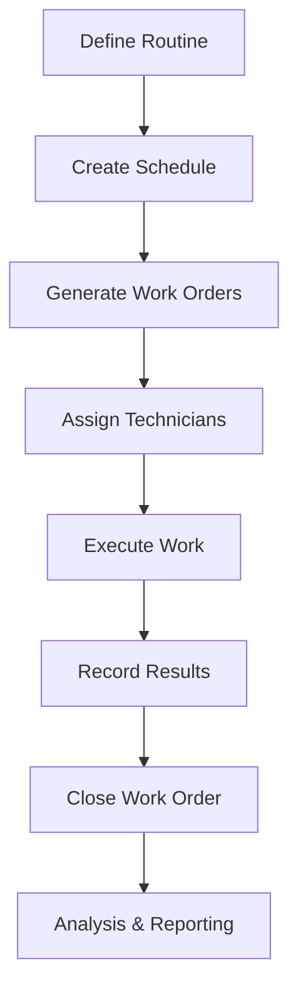
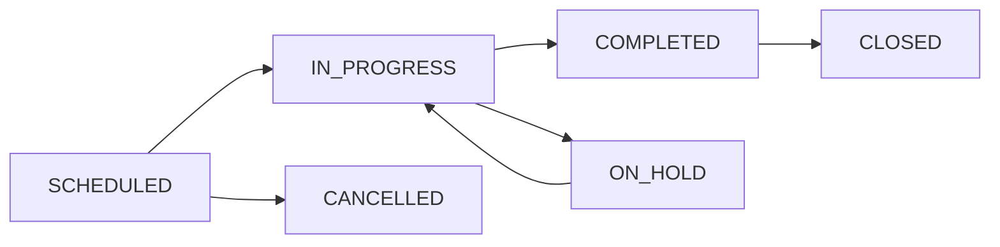

## Overview

Energy CMMS provides a comprehensive maintenance management system covering preventive, corrective, and predictive maintenance workflows.

## Maintenance Types

<CardGroup cols={3}>
  <Card title="Preventive" icon="calendar-check">
    Scheduled maintenance based on time or usage intervals
  </Card>
  <Card title="Corrective" icon="screwdriver-wrench">
    Repairs triggered by notifications or failures
  </Card>
  <Card title="Predictive" icon="chart-line">
    Condition-based interventions using monitoring data
  </Card>
</CardGroup>

## Core Workflow



## Creating Maintenance Routines

Routines define **what** maintenance should be performed:

<Steps>
  <Step title="Navigate to Routines">
    Go to **Maintenance > Routines**
  </Step>
  
  <Step title="Add New Routine">
    Click **"Add Routine"** button
  </Step>
  
  <Step title="Set Basic Information">
    - **Name**: Descriptive name (e.g., "Monthly Transformer Inspection")
    - **Code**: Unique identifier (optional, auto-generated if blank)
    - **Category**: Type of equipment (Electrical, Mechanical, etc.)
    - **Frequency**: How often to perform (Monthly, Quarterly, etc.)
  </Step>
  
  <Step title="Define Scope">
    - **Estimated Time**: Duration in HH:MM:SS format
    - **Technician Count**: Number of people required
    - **Job Position**: Required skill level
    - **Description**: Detailed instructions
  </Step>
  
  <Step title="Add Procedures">
    Create step-by-step checklists:
    - Inspection points
    - Measurements to take
    - Tools required
    - Safety precautions
  </Step>
</Steps>

<Note>
  Routines are **templates**. Scheduling creates the actual work order instances.
</Note>

## Routine Categories

Categories link maintenance routines to asset types:

```python
# Category hierarchy automatically applies routines
electrical = Tipo.objects.get(nombre="Electrical")
transformers = Tipo.objects.create(
    nombre="Transformers",
    padre=electrical,
    categoria_activo=transformer_category
)

# Routine assigned to "Electrical" applies to all transformers
```

### Category Inheritance

<Tip>
  Routines assigned to parent categories automatically apply to all child categories and their assets.
</Tip>

Example hierarchy:
- **Electrical** ← General electrical inspection
  - **Transformers** ← Transformer-specific tests
    - **Dry Type** ← Temperature monitoring
  - **Switchgear** ← Arc flash inspection

## Scheduling Maintenance

The **Visual Scheduler** wizard creates programmed maintenance:

<Steps>
  <Step title="Open Scheduler">
    Go to **Maintenance > Scheduling > Visual Scheduler**
  </Step>
  
  <Step title="Select Routine">
    Choose the maintenance routine to schedule
  </Step>
  
  <Step title="Define Schedule Pattern">
    - **Frequency**: Daily, Weekly, Monthly, Quarterly, Yearly
    - **Start Date**: When to begin
    - **End Date**: When to stop (optional, leave blank for indefinite)
    - **Working Hours**: Time window for execution
  </Step>
  
  <Step title="Select Assets">
    Choose which assets this applies to:
    - By **Location** (all equipment in area)
    - By **Category** (all motors, all pumps, etc.)
    - **Individual Assets** (specific equipment)
  </Step>
  
  <Step title="Preview & Generate">
    - Review projected work orders
    - Adjust if needed
    - Click **"Generate Orders"**
  </Step>
</Steps>

### Schedule Configuration

```python
# Example: Monthly transformer inspection
programacion = Programacion.objects.create(
    rutina=rutina,
    horario=horario,  # Working hours pattern
    fecha_inicio=date(2024, 1, 1),
    fecha_fin=date(2024, 12, 31)
)

# Apply to specific areas
programacion.areas.add(substation_a, substation_b)

# Or specific assets
programacion.activos.add(transformer_1, transformer_2)

# Generate work orders
count = programacion.generar_ordenes()
```

## Work Order Management

### Work Order Lifecycle



### Work Order States

<Tabs>
  <Tab title="Scheduled">
    **Initial state** after generation:
    - Awaiting assignment
    - Can be rescheduled
    - Can modify scope
  </Tab>
  
  <Tab title="In Progress">
    **Active execution**:
    - Technician assigned
    - Work has started
    - Materials being consumed
  </Tab>
  
  <Tab title="Completed">
    **Work finished**:
    - Pending supervisor review
    - Requires closure notes
    - Can still modify readings
  </Tab>
  
  <Tab title="Closed">
    **Finalized**:
    - Historical record
    - Included in reports
    - Triggers next cycle
  </Tab>
</Tabs>

### Bulk Operations

The system supports efficient bulk actions:

```python
# Bulk date changes
api_bulk_update_ot_dates(ot_ids=[1,2,3], nueva_fecha='2024-03-15')

# Merge multiple work orders
api_merge_ots(ot_ids=[10, 11, 12])  # Combines into single OT

# Split multi-asset work order
api_split_ot_asset(ot_id=5, asset_id=101)  # Separates one asset
```

<Warning>
  Merging work orders is irreversible. Ensure orders have compatible routines before merging.
</Warning>

## Cronogram View

Visualize maintenance schedule in calendar format:

### Features
- **Drag-and-drop rescheduling**: Move work orders between dates
- **Multi-technician view**: See workload distribution
- **Projection mode**: View future scheduled maintenance
- **Conflict detection**: Identify resource overlaps

### Filtering

```python
# Filter work orders by multiple criteria
ots = OrdenTrabajo.objects.filter(
    inicio_programado__date__range=(start_date, end_date),
    estado__in=['PROGRAMADA', 'EJECUCION'],
    ubicacion__in=selected_locations
).select_related('rutina', 'tecnico', 'ubicacion')
```

## Notifications System

Notifications trigger corrective maintenance:

<Steps>
  <Step title="Submit Notification">
    Anyone can report an issue:
    - Mobile app or web interface
    - Describe problem
    - Select affected asset
    - Indicate priority
  </Step>
  
  <Step title="Review & Prioritize">
    Maintenance coordinator reviews:
    - Assigns priority (LOW, MEDIUM, HIGH, CRITICAL)
    - Categorizes issue
    - Estimates urgency
  </Step>
  
  <Step title="Generate Work Order">
    System or coordinator creates corrective OT:
    - Links to notification
    - Assigns technician
    - Schedules intervention
  </Step>
  
  <Step title="Execute & Close">
    Technician resolves issue:
    - Records actions taken
    - Notes parts used
    - Updates asset status
    - Closes notification
  </Step>
</Steps>

### Notification Priority

<AccordionGroup>
  <Accordion title="Critical" icon="circle-exclamation">
    - Immediate safety hazard
    - Production stoppage
    - Response within 2 hours
    - Automatic escalation
  </Accordion>
  
  <Accordion title="High" icon="triangle-exclamation">
    - Major functionality impaired
    - Backup systems failing
    - Response within 24 hours
  </Accordion>
  
  <Accordion title="Medium" icon="circle-info">
    - Minor degradation
    - Scheduled within week
    - Can defer if needed
  </Accordion>
  
  <Accordion title="Low" icon="circle">
    - Cosmetic issues
    - Non-critical improvements
    - Batched with routine work
  </Accordion>
</AccordionGroup>

## Procedures and Checklists

### Creating Procedures

Structured step-by-step instructions:

```python
procedimiento = Procedimiento.objects.create(
    nombre="Transformer Oil Analysis",
    rutina=rutina
)

# Add steps
PasoProcedimiento.objects.create(
    procedimiento=procedimiento,
    orden=1,
    descripcion="Ensure transformer is de-energized",
    es_critico=True
)

PasoProcedimiento.objects.create(
    procedimiento=procedimiento,
    orden=2,
    descripcion="Extract oil sample from bottom valve",
    requiere_foto=True
)
```

### Mobile Execution

Technicians use mobile interface to:
- View assigned work orders
- Access procedures
- Check off completed steps
- Record measurements
- Upload photos
- Scan asset QR codes

## Measurement Points

Track equipment condition over time:

<Steps>
  <Step title="Define Measurement Point">
    Create monitoring point on asset:
    - Temperature sensor
    - Vibration monitor
    - Pressure gauge
    - Hour meter
  </Step>
  
  <Step title="Set Thresholds">
    Define acceptable ranges:
    - Minimum value
    - Maximum value
    - Alert conditions
  </Step>
  
  <Step title="Record Readings">
    During work order execution:
    - Technician records value
    - System checks against thresholds
    - Automatic alerts if out of range
  </Step>
  
  <Step title="Trend Analysis">
    Historical data enables:
    - Condition monitoring
    - Predictive analytics
    - Performance degradation detection
  </Step>
</Steps>

## Import/Export

### Exporting Routines

<CodeGroup>
  ```csv RUTINAS_EXPORT.csv
  id,codigo_rutina,nombre,categoria_nombre,categoria_ruta,frecuencia_nombre,tiempo_estimado,cantidad_tecnicos,descripcion
  1,RT-001,"Monthly Transformer Inspection","Transformers","Electrical → Transformers","Monthly","01:30:00",2,"Visual inspection and temperature check"
  2,RT-002,"Quarterly Oil Analysis","Transformers","Electrical → Transformers","Quarterly","00:45:00",1,"Extract and test oil sample"
  ```
  
  ```python Export Code
  # Export all routines
  from import_export import resources
  
  resource = RutinaResource()
  dataset = resource.export()
  
  # Save to file
  with open('rutinas_export.xlsx', 'wb') as f:
      f.write(dataset.xlsx)
  ```
</CodeGroup>

### Importing Routines

<Warning>
  Categories and frequencies must exist before importing. Create them first or they will be skipped.
</Warning>

**Required columns:**
- `nombre`: Routine name
- `categoria_nombre`: Must match existing category
- `frecuencia_nombre`: Must match existing frequency

**Optional columns:**
- `codigo_rutina`: Auto-generated if blank
- `tiempo_estimado`: Format HH:MM:SS (e.g., "01:30:00")
- `cantidad_tecnicos`: Integer, defaults to 1
- `descripcion`: Detailed instructions

```csv
nombre,categoria_nombre,frecuencia_nombre,tiempo_estimado,cantidad_tecnicos,descripcion
"Weekly Motor Inspection","Motors","Weekly","00:30:00",1,"Visual and thermal check"
"Annual Load Test","Generators","Yearly","04:00:00",3,"Full load performance test"
```

## Background Import Process

For large imports (1000+ routines), use background processing:

<Steps>
  <Step title="Upload File">
    Go to **Maintenance > Routines > Import (Background)**
  </Step>
  
  <Step title="Verification Mode">
    Check "Verify Only" to validate:
    - Which routines already exist
    - Which will be created
    - Any errors in data
  </Step>
  
  <Step title="Review Report">
    System shows:
    - Total rows
    - Found (will update)
    - Not found (will create)
    - Duplicates in file
  </Step>
  
  <Step title="Execute Import">
    Uncheck verification, upload again:
    - Progress bar shows status
    - Real-time error reporting
    - Transaction rollback on failure
  </Step>
</Steps>

## Work Order Reporting

### Key Metrics

<CardGroup cols={2}>
  <Card title="Completion Rate" icon="percent">
    % of scheduled work orders completed on time
  </Card>
  <Card title="Mean Time to Repair" icon="clock">
    Average time from notification to resolution
  </Card>
  <Card title="Backlog" icon="list-check">
    Number of pending work orders
  </Card>
  <Card title="Compliance" icon="shield-check">
    % of preventive maintenance performed as scheduled
  </Card>
</CardGroup>

### Custom Reports

```python
# Work order summary by location
from django.db.models import Count, Q

resumen = OrdenTrabajo.objects.filter(
    inicio_programado__year=2024
).values(
    'ubicacion__nombre'
).annotate(
    total=Count('id'),
    completadas=Count('id', filter=Q(estado='CERRADA')),
    pendientes=Count('id', filter=Q(estado__in=['PROGRAMADA', 'EJECUCION']))
).order_by('-total')
```

## Best Practices

<AccordionGroup>
  <Accordion title="Standardize Routine Names" icon="signature">
    Use consistent naming:
    - Start with frequency: "Monthly", "Quarterly"
    - Include equipment type: "Transformer", "Motor"
    - End with action: "Inspection", "Test", "Calibration"
    
    Example: "Monthly Transformer Inspection"
  </Accordion>
  
  <Accordion title="Link Routines to Categories" icon="link">
    Always assign correct category:
    - Enables automatic asset selection
    - Ensures proper routine inheritance
    - Facilitates reporting and analysis
  </Accordion>
  
  <Accordion title="Set Realistic Durations" icon="stopwatch">
    Accurate time estimates improve:
    - Work scheduling efficiency
    - Resource allocation
    - Workload balancing
    
    Review and adjust based on actual completion times.
  </Accordion>
  
  <Accordion title="Use Procedures for Consistency" icon="list">
    Create detailed checklists:
    - Ensures nothing is missed
    - Standardizes execution
    - Facilitates training
    - Improves safety
  </Accordion>
</AccordionGroup>

## Integration Points

### With Inventory
- Material requisitions from work orders
- Automatic stock consumption
- Spare parts recommendations

### With Budgets
- Maintenance cost tracking
- Budget vs actual analysis
- Forecasting future costs

### With Safety
- Work permit requirements
- JSA/Risk analysis linkage
- Safety checklist compliance

---

**Next Steps:**
- [Manage Asset Inventory](/guides/asset-management)
- [Configure Requisitions](/guides/requisitions)
- [Set Up Work Permits](/guides/work-permits)