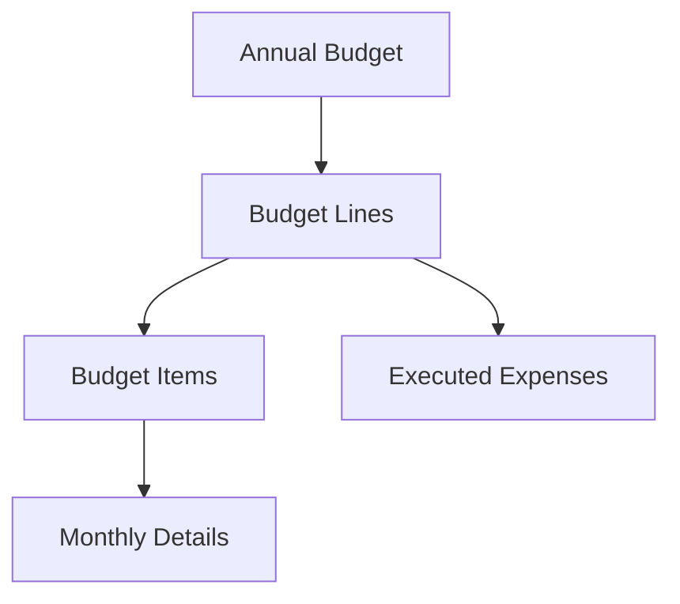
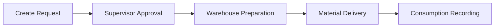

## Overview

Energy CMMS provides comprehensive budget planning, tracking, and material requisition workflows integrated with maintenance operations.

## Budget Structure

Budgets are organized hierarchically:



### Budget Components

<CardGroup cols={3}>
  <Card title="Budget Lines" icon="layer-group">
    Major categories (disciplines) like Electrical, Mechanical, Civil
  </Card>
  <Card title="Items" icon="list">
    Specific expense concepts within each line
  </Card>
  <Card title="Monthly Details" icon="calendar">
    Projected spending distribution across months
  </Card>
</CardGroup>

## Creating Annual Budgets

<Steps>
  <Step title="Navigate to Budgets">
    Go to **Budgets > Annual Budgets**
  </Step>
  
  <Step title="Create Budget">
    Click **"Add Annual Budget"**:
    - **Year**: Fiscal year
    - **Name**: Descriptive name (e.g., "2024 Maintenance Budget")
    - **Currency**: Default currency
  </Step>
  
  <Step title="Add Budget Lines">
    Create lines by discipline:
    - Link to **Discipline** (auto-creates from Asset Categories)
    - Or use **Description** for custom lines
    - Set **Projected Amount** (optional, calculated from items)
  </Step>
  
  <Step title="Define Items">
    Within each line, create specific expense items:
    - **Concept**: What you're budgeting for
    - **Frequency**: How often this expense occurs
    - **Is Recurring**: Auto-distribute across months
  </Step>
  
  <Step title="Distribute Across Months">
    For each item, set monthly projections:
    - Manual entry per month
    - Or use recurring patterns
    - Total validates against yearly amount
  </Step>
</Steps>

### Budget Item Configuration

```python
# Example: Creating recurring monthly expense
item = ItemPresupuesto.objects.create(
    partida=partida,
    concepto="Electrical Spare Parts",
    frecuencia='MENSUAL',
    es_recurrente=True
)

# Distribute equally across 12 months
for mes in range(1, 13):
    DetallePeriodico.objects.create(
        item=item,
        mes=mes,
        monto=1000.00  # $1,000 per month
    )
```

## Budget Cronogram View

Visualize budget execution over time:

<Tabs>
  <Tab title="Single Budget">
    View one budget's performance:
    - Monthly projected vs actual
    - By discipline breakdown
    - Item-level detail
    - Cumulative spending curves
  </Tab>
  
  <Tab title="Group Analysis">
    Compare multiple budgets:
    - Multi-site consolidation
    - Department comparison
    - Year-over-year analysis
    - Variance reporting
  </Tab>
</Tabs>

### Key Features

<AccordionGroup>
  <Accordion title="Interactive Editing" icon="pen-to-square">
    Edit projections directly in the cronogram:
    - Click any cell to modify
    - Real-time total recalculation
    - Instant validation
  </Accordion>
  
  <Accordion title="Visual Indicators" icon="chart-line">
    Color-coded status:
    - 🟢 Under budget
    - 🟡 On target
    - 🟠 Approaching limit
    - 🔴 Over budget
  </Accordion>
  
  <Accordion title="Drill-Down Analysis" icon="magnifying-glass">
    Click any value to see:
    - Contributing expenses
    - Related work orders
    - Material consumptions
    - Invoice details
  </Accordion>
</AccordionGroup>

## Executing Against Budget

Record actual expenses:

<Steps>
  <Step title="Link to Budget Line">
    When creating expense, select:
    - Budget year
    - Budget line (discipline)
    - Specific item (if applicable)
  </Step>
  
  <Step title="Record Expense">
    **GastoEjecutado** model captures:
    - Date of expense
    - Amount
    - Description
    - Supporting documents
  </Step>
  
  <Step title="Automatic Tracking">
    System updates:
    - Monthly execution totals
    - Budget vs actual variance
    - Remaining balance
    - Alerts if over budget
  </Step>
</Steps>

### Expense Recording

```python
# Record an executed expense
gasto = GastoEjecutado.objects.create(
    partida=partida,
    fecha=date.today(),
    monto=850.50,
    descripcion="Motor repair parts",
    orden_trabajo=orden  # Optional link to work order
)
```

<Note>
  Expenses can be linked to work orders, material movements, or purchase orders for full traceability.
</Note>

## Material Requisitions

Request materials needed for maintenance:

### Requisition Workflow



### Creating Requisitions

<Steps>
  <Step title="Initiate Request">
    From work order or standalone:
    - Requestor
    - Delivery location
    - Required date
    - Priority level
  </Step>
  
  <Step title="Add Items">
    For each material:
    - Material/part number
    - Quantity required
    - Purpose/work order
    - Alternative options
  </Step>
  
  <Step title="Submit for Approval">
    Routing based on value:
    - Low value: Automatic approval
    - Medium: Supervisor approval
    - High: Manager approval
  </Step>
  
  <Step title="Warehouse Fulfillment">
    Once approved:
    - Generate pick list
    - Reserve stock
    - Prepare items
    - Schedule delivery
  </Step>
  
  <Step title="Receive & Consume">
    At delivery:
    - Technician confirms receipt
    - System records consumption
    - Updates work order costs
    - Reduces inventory
  </Step>
</Steps>

### Requisition States

<Tabs>
  <Tab title="Draft">
    **Being prepared**:
    - Can add/remove items
    - Not yet submitted
    - No approvals started
  </Tab>
  
  <Tab title="Pending Approval">
    **In approval workflow**:
    - Awaiting supervisor review
    - Cannot modify items
    - Can be rejected
  </Tab>
  
  <Tab title="Approved">
    **Ready for fulfillment**:
    - Warehouse notified
    - Stock being prepared
    - Delivery scheduled
  </Tab>
  
  <Tab title="Fulfilled">
    **Completed**:
    - Materials delivered
    - Consumption recorded
    - Costs allocated
  </Tab>
</Tabs>

## Integration with Work Orders

Automatic material requisitions:

```python
# Work order triggers requisition
orden = OrdenTrabajo.objects.get(id=123)

# System checks routine for required materials
if orden.rutina:
    materiales_necesarios = orden.rutina.materiales_requeridos.all()
    
    # Create requisition automatically
    requisicion = MaterialRequisition.objects.create(
        orden_trabajo=orden,
        solicitante=orden.tecnico,
        ubicacion_entrega=orden.ubicacion
    )
    
    # Add materials
    for item in materiales_necesarios:
        requisicion.items.create(
            material=item.material,
            cantidad=item.cantidad * orden.activos.count()
        )
```

<Tip>
  Configure routine templates with standard materials to automatically generate requisitions when work orders are created.
</Tip>

## Budget Reports

### Standard Reports

<CardGroup cols={2}>
  <Card title="Monthly Summary" icon="calendar">
    **Month-by-month analysis**:
    - Projected vs actual
    - Variance analysis
    - Trending indicators
  </Card>
  
  <Card title="Discipline Breakdown" icon="layer-group">
    **By category performance**:
    - Each budget line
    - Item-level detail
    - Top expense drivers
  </Card>
  
  <Card title="Efficiency Metrics" icon="gauge-high">
    **Budget utilization**:
    - % spent to date
    - Burn rate
    - Projected year-end
  </Card>
  
  <Card title="Variance Report" icon="chart-column">
    **Over/under analysis**:
    - Significant deviations
    - Root cause tracking
    - Corrective actions
  </Card>
</CardGroup>

### Export Options

<Tabs>
  <Tab title="Excel - Matrix Format">
    ```python
    # Standard cronogram export
    response = exportar_cronograma_excel(request, pk=budget_id)
    ```
    
    **Contains**:
    - Disciplines as rows
    - Months as columns
    - Projected and actual values
    - Visual formatting
  </Tab>
  
  <Tab title="Excel - Pivot Format">
    ```python
    # Flat format for pivot tables
    response = exportar_cronograma_grupal_excel_pivot(request, pk=group_id)
    ```
    
    **Structure**:
    - One row per item per month
    - All dimensions as columns
    - Ready for pivot analysis
  </Tab>
  
  <Tab title="PDF Report">
    ```python
    # Formatted PDF with charts
    response = exportar_cronograma_pdf(request, pk=budget_id)
    ```
    
    **Includes**:
    - Executive summary
    - Visual charts
    - Detailed tables
    - Variance commentary
  </Tab>
</Tabs>

## Budget Grouping

Consolidate multiple budgets:

<Steps>
  <Step title="Create Budget Group">
    Go to **Budgets > Grouped Budgets**:
    - Name (e.g., "All Sites 2024")
    - Description
  </Step>
  
  <Step title="Add Budgets">
    Select individual budgets to include:
    - Different locations
    - Different departments
    - Different years (for comparison)
  </Step>
  
  <Step title="View Consolidated Analysis">
    Group view shows:
    - Total across all budgets
    - Per-budget breakdown
    - Comparative metrics
    - Drill-down capability
  </Step>
</Steps>

### Group Analysis Features

```python
# Consolidated monthly totals
data = _get_cronograma_data(presupuestos_list)

# Returns aggregated structure:
{
    'presupuestos_data': [...]  # Individual budget details
    'global_proyectado_mes': [...]  # Sum of all projected by month
    'global_ejecutado_mes': [...]  # Sum of all executed by month
    'total_general_proyectado': X  # Grand total projected
    'total_general_ejecutado': Y  # Grand total executed
}
```

## Real-Time Budget Updates

Automatic updates from various sources:

<AccordionGroup>
  <Accordion title="Work Order Completion" icon="wrench">
    When closing work order:
    - Labor hours recorded
    - Materials consumed
    - External services invoiced
    - All costs hit budget automatically
  </Accordion>
  
  <Accordion title="Inventory Movements" icon="boxes-stacked">
    Material withdrawals:
    - Warehouse issues materials
    - Costed at average or FIFO
    - Charged to requisition's budget line
  </Accordion>
  
  <Accordion title="Purchase Orders" icon="cart-shopping">
    When PO is received:
    - Accrual against budget
    - Final cost on invoice
    - Variance tracking
  </Accordion>
  
  <Accordion title="Manual Entries" icon="keyboard">
    Direct expense recording:
    - Admin records cost
    - Links to budget line
    - Includes supporting docs
  </Accordion>
</AccordionGroup>

## Forecasting and Projections

### Automated Projections

```python
# Extend current spending trends
from django.db.models import Sum
from datetime import date

# Calculate burn rate
meses_transcurridos = date.today().month
total_gastado = partida.gastos.aggregate(
    total=Sum('monto')
)['total'] or 0

burn_rate = total_gastado / meses_transcurridos
proyeccion_anual = burn_rate * 12

# Compare to budget
if proyeccion_anual > partida.monto_proyectado:
    alert_over_budget()
```

### Scenario Planning

<Tip>
  Create multiple budget versions to model different scenarios: conservative, expected, and optimistic.
</Tip>

## Budget Alerts and Notifications

Automated monitoring:

### Alert Types

<CardGroup cols={2}>
  <Card title="Threshold Alerts" icon="bell">
    Notify when:
    - 75% of budget consumed
    - 90% of budget consumed
    - Budget exceeded
  </Card>
  
  <Card title="Variance Alerts" icon="triangle-exclamation">
    Significant deviations:
    - >20% over in any month
    - Unusual spending pattern
    - Large single transactions
  </Card>
  
  <Card title="Approval Alerts" icon="clipboard-check">
    Workflow notifications:
    - Pending approvals
    - Rejected requisitions
    - Awaiting documents
  </Card>
  
  <Card title="Forecasting Alerts" icon="crystal-ball">
    Projected issues:
    - Will exceed budget by year-end
    - Underspending (unexecuted work)
    - Reallocation opportunities
  </Card>
</CardGroup>

## Budget vs Actual Analysis

Key performance indicators:

```python
# Calculate variance metrics
from django.db.models import Sum, F

analysis = PartidaPresupuestaria.objects.annotate(
    ejecutado=Sum('gastos__monto'),
    varianza=F('monto_proyectado') - F('ejecutado'),
    pct_usado=F('ejecutado') * 100.0 / F('monto_proyectado')
).filter(
    presupuesto_anual__anio=2024
)
```

### Visualization

<Tabs>
  <Tab title="Monthly Comparison">
    Line chart showing:
    - Projected (dotted line)
    - Actual (solid line)
    - Cumulative curves
    - Variance shading
  </Tab>
  
  <Tab title="Discipline Heatmap">
    Matrix showing:
    - Rows: Budget lines
    - Columns: Months
    - Color intensity: % variance
  </Tab>
  
  <Tab title="Waterfall Chart">
    Shows budget changes:
    - Starting budget
    - Adjustments
    - Transfers
    - Final budget
    - Executed
    - Remaining
  </Tab>
</Tabs>

## Best Practices

<AccordionGroup>
  <Accordion title="Regular Reconciliation" icon="calendar-check">
    **Monthly closeout process**:
    - Review all expenses
    - Verify coding
    - Identify discrepancies
    - Accrue pending invoices
  </Accordion>
  
  <Accordion title="Detailed Item Breakdown" icon="list">
    **Granular tracking**:
    - Don't lump everything into one item
    - Separate predictable costs
    - Track by work type
    - Enable meaningful analysis
  </Accordion>
  
  <Accordion title="Link to Work Orders" icon="link">
    **Full traceability**:
    - Always link expenses to work orders
    - Enables cost-per-asset analysis
    - Supports labor hour tracking
    - Justifies budget requests
  </Accordion>
  
  <Accordion title="Historical Comparison" icon="clock-rotate-left">
    **Year-over-year analysis**:
    - Compare to previous years
    - Identify trends
    - Justify budget increases
    - Benchmark performance
  </Accordion>
</AccordionGroup>

## CAPEX vs OPEX

Distinguish capital from operational expenses:

<Tabs>
  <Tab title="OPEX - Operational">
    **Recurring maintenance costs**:
    - Routine maintenance
    - Consumables
    - Labor
    - Utilities
    
    Expensed immediately, hits budget.
  </Tab>
  
  <Tab title="CAPEX - Capital">
    **Asset improvements**:
    - New equipment
    - Major overhauls
    - System upgrades
    - Building improvements
    
    Depreciated over time, separate tracking.
  </Tab>
</Tabs>

<Note>
  Configure budget lines with `tipo` field to distinguish CAPEX vs OPEX for proper financial reporting.
</Note>

## Integration Points

### With Inventory
- Material costs flow automatically
- Requisition approval workflows
- Stock valuation methods (FIFO, Average)

### With Purchasing
- Purchase order accruals
- Vendor invoice matching
- Three-way matching (PO, Receipt, Invoice)

### With Maintenance
- Work order cost accumulation
- Labor hour costing
- Equipment downtime costs

---

**Next Steps:**
- [Configure Work Permits](/guides/work-permits)
- [Set Up Document Control](/guides/document-control)
- [Manage Inventory](/guides/inventory-management)