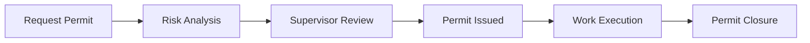
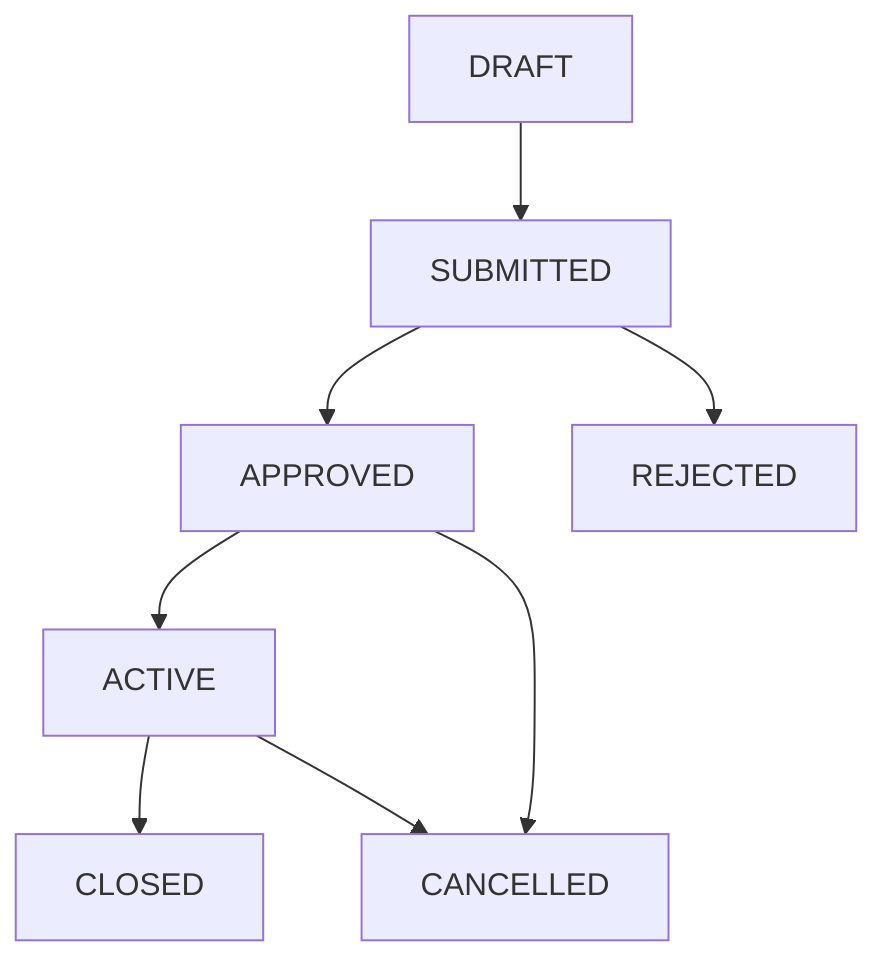
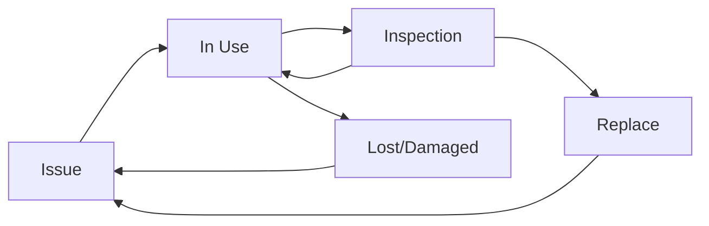

## Overview

Energy CMMS includes comprehensive safety management tools to ensure safe work practices through permits, risk analysis, and inspections.

## Work Permit System

Controlled work authorization and tracking:



### Permit Types

<CardGroup cols={3}>
  <Card title="Hot Work" icon="fire">
    Welding, cutting, grinding, or other spark-generating activities
  </Card>
  <Card title="Confined Space" icon="person-digging">
    Entry into tanks, vessels, manholes with limited access
  </Card>
  <Card title="Work at Heights" icon="person-falling">
    Activities above 1.8m (6 feet) requiring fall protection
  </Card>
  <Card title="Electrical Work" icon="bolt">
    Live electrical work or lockout/tagout procedures
  </Card>
  <Card title="Excavation" icon="shovel">
    Ground penetration or trenching activities
  </Card>
  <Card title="Cold Work" icon="wrench">
    General maintenance in operating areas
  </Card>
</CardGroup>

## Creating Work Permits

<Steps>
  <Step title="Navigate to Permits">
    Go to **Safety > Work Permits**
  </Step>
  
  <Step title="Select Permit Type">
    Choose appropriate type based on hazards:
    - Hot Work
    - Confined Space
    - Work at Heights
    - Multiple types if needed
  </Step>
  
  <Step title="Define Work Scope">
    Provide detailed information:
    - **Description**: What work will be done
    - **Location**: Exact work area
    - **Start Date/Time**: When work begins
    - **End Date/Time**: Expected completion
  </Step>
  
  <Step title="Link to Work Order">
    Connect permit to maintenance order:
    - Auto-populates location and equipment
    - Tracks permit against work completion
    - Enables cost allocation
  </Step>
  
  <Step title="Complete Requirements Checklist">
    Verify all prerequisites:
    - Training certifications
    - Equipment inspections
    - Atmospheric testing
    - Emergency procedures briefed
  </Step>
</Steps>

### Permit Requirements

Each permit type has specific requirements:

```python
# Example: Hot Work Permit requirements
requisitos_hot_work = [
    RequisitoPermiso(
        tipo_permiso=hot_work_type,
        texto="Fire extinguisher present at worksite",
        es_critico=True,
        orden=1
    ),
    RequisitoPermiso(
        tipo_permiso=hot_work_type,
        texto="Fire watch assigned for duration and 30 min after",
        es_critico=True,
        orden=2
    ),
    RequisitoPermiso(
        tipo_permiso=hot_work_type,
        texto="Combustible materials removed from area",
        es_critico=True,
        orden=3
    ),
    RequisitoPermiso(
        tipo_permiso=hot_work_type,
        texto="Hot work equipment inspected",
        es_critico=False,
        orden=4
    )
]
```

<Warning>
  **Critical requirements** (marked `es_critico=True`) must be verified before permit can be issued. Work cannot proceed without them.
</Warning>

## Job Safety Analysis (JSA)

Systematic risk identification linked to permits:

### JSA Structure

<AccordionGroup>
  <Accordion title="Work Steps" icon="list-ol">
    Break down job into sequential steps:
    - Each major task
    - Logical order
    - Manageable detail level
  </Accordion>
  
  <Accordion title="Hazards" icon="triangle-exclamation">
    Identify risks for each step:
    - Physical hazards
    - Chemical exposures
    - Ergonomic issues
    - Environmental factors
  </Accordion>
  
  <Accordion title="Controls" icon="shield-check">
    Define mitigation measures:
    - Engineering controls
    - Administrative procedures
    - Personal protective equipment
    - Training requirements
  </Accordion>
</AccordionGroup>

### Creating JSA

<Steps>
  <Step title="Initiate Analysis">
    Create new **AnalisisRiesgo** record:
    - Link to work location
    - Describe overall work
    - Assign team leader
    - Add participating workers
  </Step>
  
  <Step title="Define Work Steps">
    For each major task:
    ```python
    paso = PasoTrabajo.objects.create(
        analisis=jsa,
        descripcion="Install new motor coupling",
        orden=1
    )
    ```
  </Step>
  
  <Step title="Identify Hazards">
    For each step, list risks:
    ```python
    Riesgo.objects.create(
        paso=paso,
        descripcion="Pinch points during alignment"
    )
    ```
  </Step>
  
  <Step title="Define Controls">
    For each hazard, specify mitigation:
    ```python
    Control.objects.create(
        riesgo=riesgo,
        descripcion="Use proper hand placement, wear gloves"
    )
    ```
  </Step>
  
  <Step title="Team Review">
    All workers sign off:
    - Understand hazards
    - Know controls
    - Agree to procedures
  </Step>
</Steps>

### JSA Template

<CodeGroup>
  ```json JSA Example
  {
    "trabajo": "Motor Replacement",
    "ubicacion": "Pump Room A",
    "fecha": "2024-03-15",
    "lider": "John Smith",
    "equipo": ["Jane Doe", "Mike Johnson"],
    "pasos": [
      {
        "numero": 1,
        "descripcion": "Lockout/Tagout electrical source",
        "riesgos": [
          {
            "descripcion": "Electrical shock",
            "controles": [
              "Verify de-energization with multimeter",
              "Apply personal locks",
              "Test for zero energy"
            ]
          }
        ]
      },
      {
        "numero": 2,
        "descripcion": "Disconnect and remove old motor",
        "riesgos": [
          {
            "descripcion": "Heavy lifting - muscle strain",
            "controles": [
              "Use hoist for motor removal",
              "Team lift with proper technique",
              "Take breaks as needed"
            ]
          }
        ]
      }
    ]
  }
  ```
</CodeGroup>

<Tip>
  Create JSA templates for common jobs. Reuse and customize instead of starting from scratch each time.
</Tip>

## Permit Workflow States

### State Transitions



<Tabs>
  <Tab title="Draft">
    **Being prepared**:
    - Requestor filling out form
    - Requirements being verified
    - JSA being completed
    - Not yet submitted for review
  </Tab>
  
  <Tab title="Submitted">
    **Pending approval**:
    - Supervisor reviewing
    - Checking requirements
    - May request corrections
    - Cannot modify during review
  </Tab>
  
  <Tab title="Approved">
    **Ready to execute**:
    - All requirements verified
    - JSA signed off
    - Waiting for work to start
    - Valid for specified dates
  </Tab>
  
  <Tab title="Active">
    **Work in progress**:
    - Permit displayed at worksite
    - Continuous monitoring
    - Can be suspended if conditions change
    - Must be closed upon completion
  </Tab>
  
  <Tab title="Closed">
    **Completed**:
    - Work finished
    - Area inspected
    - No outstanding items
    - Historical record
  </Tab>
</Tabs>

### Approval Workflow

```python
# Permit approval chain
permiso = PermisoTrabajo.objects.get(id=123)

# Supervisor reviews and approves
if all_requirements_met(permiso):
    permiso.estado = 'APROBADO'
    permiso.autorizado_por = supervisor
    permiso.fecha_autorizacion = timezone.now()
    permiso.save()
    
    # Notify workers
    notify_permit_approved(permiso)
else:
    # Request corrections
    permiso.estado = 'BORRADOR'
    permiso.save()
    notify_corrections_needed(permiso)
```

## Safety Inspections

Regular facility and equipment safety checks:

### Inspection Types

<CardGroup cols={2}>
  <Card title="Pre-Use Equipment" icon="clipboard-check">
    Daily checks before using:
    - Fall protection gear
    - Lifting equipment
    - Power tools
    - Vehicles
  </Card>
  
  <Card title="Area Inspections" icon="building">
    Periodic facility audits:
    - Fire safety
    - Housekeeping
    - Exit routes
    - Safety equipment
  </Card>
  
  <Card title="Permit Verification" icon="file-circle-check">
    Validate active permits:
    - Requirements still met
    - Conditions unchanged
    - Controls in place
  </Card>
  
  <Card title="Incident Investigation" icon="magnifying-glass">
    Post-incident review:
    - Root cause analysis
    - Witness statements
    - Corrective actions
  </Card>
</CardGroup>

### Inspection Process

<Steps>
  <Step title="Create Inspection">
    Initialize inspection record:
    - Select inspection type
    - Assign inspector
    - Set location/equipment
    - Load checklist
  </Step>
  
  <Step title="Execute Checklist">
    For each item, record status:
    ```python
    ResultadoInspeccion.objects.create(
        inspeccion=inspeccion,
        item=checklist_item,
        estado='CUMPLE',  # or 'NO_CUMPLE', 'NO_APLICA'
        observacion="Minor rust on railing",
        foto=uploaded_image
    )
    ```
  </Step>
  
  <Step title="Document Findings">
    Capture evidence:
    - Photos of issues
    - Observations
    - Recommendations
  </Step>
  
  <Step title="Determine Overall Result">
    Inspection outcome:
    - **APROBADO**: All items pass
    - **CON_HALLAZGOS**: Minor issues noted
    - **RECHAZADO**: Critical failures
  </Step>
  
  <Step title="Generate Actions">
    For non-compliant items:
    - Create corrective work orders
    - Assign responsibility
    - Set deadline
    - Follow up
  </Step>
</Steps>

### Mobile Inspections

<Tip>
  Use mobile devices for field inspections. Real-time data capture, photos, and GPS location improve accuracy and efficiency.
</Tip>

## Incident Reporting

Capture and investigate safety events:

### Incident Severity

<Tabs>
  <Tab title="Low">
    **Minor issues**:
    - Near miss
    - First aid only
    - Property damage less than $1,000
    - No lost time
  </Tab>
  
  <Tab title="Medium">
    **Moderate impact**:
    - Medical treatment required
    - Property damage $1,000-$10,000
    - Lost time less than 3 days
    - Environmental release contained
  </Tab>
  
  <Tab title="High">
    **Serious incident**:
    - Recordable injury
    - Property damage $10,000-$100,000
    - Lost time >3 days
    - Regulatory notification
  </Tab>
  
  <Tab title="Critical">
    **Severe incident**:
    - Fatality or permanent disability
    - Major property damage >$100,000
    - Environmental emergency
    - Facility shutdown
    - Media attention
  </Tab>
</Tabs>

### Incident Workflow

<Steps>
  <Step title="Immediate Reporting">
    Anyone can submit incident:
    - Mobile app or web
    - Date/time/location
    - Brief description
    - Injured persons
    - Immediate actions taken
  </Step>
  
  <Step title="Initial Response">
    Safety team reviews:
    - Assess severity
    - Secure scene
    - Provide first aid
    - Notify management
  </Step>
  
  <Step title="Investigation">
    Detailed analysis:
    - Interview witnesses
    - Document scene
    - Collect evidence
    - Timeline reconstruction
  </Step>
  
  <Step title="Root Cause Analysis">
    Identify underlying factors:
    - Immediate causes
    - Contributing factors
    - Systemic issues
    - 5 Whys technique
  </Step>
  
  <Step title="Corrective Actions">
    Prevent recurrence:
    - Engineering changes
    - Procedure updates
    - Training programs
    - Follow-up audits
  </Step>
</Steps>

### Incident Model

```python
incidente = Incidente.objects.create(
    titulo="Fall from ladder",
    tipo=incident_type,
    descripcion="Worker fell from 6-foot ladder while...",
    fecha_ocurrencia=timezone.now(),
    ubicacion=work_location,
    reportado_por=witness,
    severidad='ALTA',
    estado='EN_PROCESO'
)
```

## Personal Protective Equipment (PPE)

Track PPE issuance and compliance:

### PPE Management

<Steps>
  <Step title="Define PPE Requirements">
    By job type or area:
    - Hard hat
    - Safety glasses
    - Steel toe boots
    - Gloves (specific type)
    - Hearing protection
    - Respirator (if needed)
  </Step>
  
  <Step title="Issue PPE">
    Record issuance to workers:
    ```python
    AsignacionEPP.objects.create(
        miembro=worker,
        material=ppe_item,
        cantidad=1,
        fecha_entrega=date.today(),
        motivo="Initial issue",
        fecha_proxima_entrega=date.today() + timedelta(days=180)
    )
    ```
  </Step>
  
  <Step title="Track Condition">
    Monitor PPE status:
    - Inspection records
    - Damage reports
    - Replacement needs
  </Step>
  
  <Step title="Enforce Compliance">
    During inspections:
    - Verify proper use
    - Check condition
    - Replace expired items
    - Training if misused
  </Step>
</Steps>

### PPE Lifecycle



## Training & Certification

Track safety training compliance:

### Training Requirements

<CardGroup cols={2}>
  <Card title="Initial Training" icon="graduation-cap">
    Before starting work:
    - Company safety orientation
    - Hazard communication
    - Emergency procedures
    - Job-specific training
  </Card>
  
  <Card title="Refresher Training" icon="rotate">
    Periodic updates:
    - Annual safety review
    - New procedure rollouts
    - Incident lessons learned
    - Regulatory changes
  </Card>
  
  <Card title="Certifications" icon="certificate">
    Special qualifications:
    - Confined space entry
    - Forklift operation
    - First aid/CPR
    - Arc flash qualified
  </Card>
  
  <Card title="Competency Checks" icon="clipboard-list">
    Practical assessments:
    - Lockout/tagout procedure
    - Fall protection setup
    - Fire extinguisher use
    - Emergency response
  </Card>
</CardGroup>

### Training Tracking

```python
# Link training to permits
if not worker.has_valid_certification('Confined Space'):
    permit.estado = 'RECHAZADO'
    permit.motivo_rechazo = "Worker not certified for confined space"
    permit.save()
```

## Safety Dashboards

Real-time safety metrics:

### Key Indicators

<CardGroup cols={3}>
  <Card title="Days Since Incident" icon="calendar-days">
    Consecutive days without recordable injury
  </Card>
  <Card title="Open Permits" icon="file-lines">
    Currently active work permits
  </Card>
  <Card title="Pending Inspections" icon="list-check">
    Overdue or upcoming inspections
  </Card>
  <Card title="Training Due" icon="clock">
    Workers with expiring certifications
  </Card>
  <Card title="Incident Rate" icon="chart-line">
    OSHA recordable injury rate
  </Card>
  <Card title="Audit Findings" icon="magnifying-glass">
    Open corrective actions
  </Card>
</CardGroup>

## Regulatory Compliance

### OSHA Recordkeeping

<AccordionGroup>
  <Accordion title="OSHA 300 Log" icon="book">
    **Annual injury log**:
    - Record all work-related injuries/illnesses
    - Classify by severity
    - Track lost time
    - Post annual summary
  </Accordion>
  
  <Accordion title="OSHA 300A Summary" icon="file-chart-column">
    **Annual posting**:
    - Total cases for the year
    - Injury/illness rates
    - Posted Feb 1 - Apr 30
    - Management certification
  </Accordion>
  
  <Accordion title="OSHA 301" icon="file-medical">
    **Incident detail form**:
    - Full description
    - Witness statements
    - Root cause
    - Corrective actions
  </Accordion>
</AccordionGroup>

## Best Practices

<Tip>
  **Leading Indicators**: Track proactive measures (inspections completed, near misses reported, training hours) not just incidents.
</Tip>

<AccordionGroup>
  <Accordion title="Pre-Job Briefings" icon="users">
    **Daily toolbox talks**:
    - Review JSA
    - Discuss permit requirements
    - Identify changed conditions
    - Confirm roles and responsibilities
  </Accordion>
  
  <Accordion title="Stop Work Authority" icon="hand">
    **Empower all workers**:
    - Anyone can stop unsafe work
    - No retribution policy
    - Supervisor notification
    - Resume only when safe
  </Accordion>
  
  <Accordion title="Near Miss Reporting" icon="flag">
    **Proactive identification**:
    - Encourage reporting
    - Anonymous options
    - Quick investigation
    - Share lessons learned
  </Accordion>
  
  <Accordion title="Continuous Improvement" icon="arrows-rotate">
    **Safety culture**:
    - Regular safety meetings
    - Worker involvement
    - Trend analysis
    - Benchmark against industry
  </Accordion>
</AccordionGroup>

## Integration Points

### With Maintenance
- Permits linked to work orders
- JSA triggers maintenance procedures
- Incident investigation may reveal maintenance issues

### With Training
- Permit requirements verify certifications
- Incident analysis identifies training needs
- Compliance tracking for audits

### With Inventory
- PPE stock management
- Safety equipment calibration
- Emergency equipment locations

---

**Next Steps:**
- [Configure Document Control](/guides/document-control)
- [Set Up Asset Management](/guides/asset-management)
- [Manage Inventory](/guides/inventory-management)