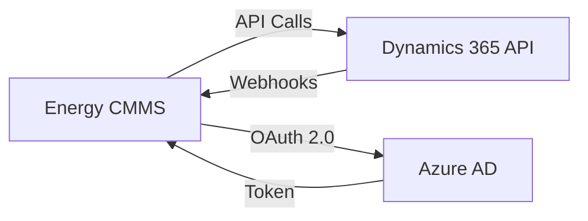

## Overview

Energy CMMS supports integration with Microsoft Dynamics 365 for synchronizing financial data, purchase orders, and asset information between systems.

## Integration Architecture



## Configuration

### Environment Variables

Add these settings to your `settings.py` or environment configuration:

<CodeGroup>

```python settings.py
# Microsoft Dynamics 365 Configuration
DYNAMICS_365_TENANT_ID = os.environ.get('DYNAMICS_365_TENANT_ID', '')
DYNAMICS_365_CLIENT_ID = os.environ.get('DYNAMICS_365_CLIENT_ID', '')
DYNAMICS_365_CLIENT_SECRET = os.environ.get('DYNAMICS_365_CLIENT_SECRET', '')
DYNAMICS_365_RESOURCE_URL = os.environ.get(
    'DYNAMICS_365_RESOURCE_URL',
    'https://your-org.crm.dynamics.com'
)

# API Endpoints
DYNAMICS_365_API_VERSION = '9.2'
DYNAMICS_365_BASE_URL = f"{DYNAMICS_365_RESOURCE_URL}/api/data/v{DYNAMICS_365_API_VERSION}"
```

```env .env
# Dynamics 365 Authentication
DYNAMICS_365_TENANT_ID=your-tenant-id
DYNAMICS_365_CLIENT_ID=your-app-id
DYNAMICS_365_CLIENT_SECRET=your-client-secret
DYNAMICS_365_RESOURCE_URL=https://your-org.crm.dynamics.com
```

```bash Docker
# Docker environment
docker run -e DYNAMICS_365_TENANT_ID=your-tenant-id \
  -e DYNAMICS_365_CLIENT_ID=your-app-id \
  -e DYNAMICS_365_CLIENT_SECRET=your-secret \
  -e DYNAMICS_365_RESOURCE_URL=https://your-org.crm.dynamics.com \
  energia-cmms
```

</CodeGroup>

## Authentication Setup

<Steps>

### Register Application in Azure AD

1. Go to [Azure Portal](https://portal.azure.com)
2. Navigate to **Azure Active Directory** > **App registrations**
3. Click **New registration**
4. Set name: "Energy CMMS Integration"
5. Select **Accounts in this organizational directory only**
6. Click **Register**

### Configure API Permissions

1. In your app registration, go to **API permissions**
2. Click **Add a permission** > **Dynamics CRM**
3. Select **Delegated permissions**
4. Check `user_impersonation`
5. Click **Grant admin consent**

### Create Client Secret

1. Go to **Certificates & secrets**
2. Click **New client secret**
3. Set description: "Energy CMMS Production"
4. Select expiration period
5. Copy the secret value immediately (won't be shown again)

### Update Redirect URIs

1. Go to **Authentication**
2. Add Redirect URI: `https://your-cmms-domain.com/auth/callback`
3. Enable **Access tokens** and **ID tokens**
4. Save changes

</Steps>

## Integration Modules

### Purchase Order Sync

Sync purchase orders and requisitions from Energy CMMS to Dynamics 365:

```python presupuestos/dynamics.py
import requests
from django.conf import settings

class Dynamics365Client:
    def __init__(self):
        self.base_url = settings.DYNAMICS_365_BASE_URL
        self.access_token = self._get_access_token()
    
    def _get_access_token(self):
        """Obtain OAuth token from Azure AD"""
        token_url = f"https://login.microsoftonline.com/{settings.DYNAMICS_365_TENANT_ID}/oauth2/v2.0/token"
        
        data = {
            'grant_type': 'client_credentials',
            'client_id': settings.DYNAMICS_365_CLIENT_ID,
            'client_secret': settings.DYNAMICS_365_CLIENT_SECRET,
            'scope': f"{settings.DYNAMICS_365_RESOURCE_URL}/.default"
        }
        
        response = requests.post(token_url, data=data)
        response.raise_for_status()
        return response.json()['access_token']
    
    def create_purchase_order(self, requisicion):
        """Create purchase order in Dynamics 365"""
        headers = {
            'Authorization': f'Bearer {self.access_token}',
            'Content-Type': 'application/json',
            'OData-MaxVersion': '4.0',
            'OData-Version': '4.0'
        }
        
        payload = {
            'name': requisicion.numero_requisicion,
            'description': requisicion.justificacion,
            'totalamount': float(requisicion.total),
            'statecode': 0,  # Active
            'statuscode': 1   # In Progress
        }
        
        response = requests.post(
            f"{self.base_url}/salesorders",
            headers=headers,
            json=payload
        )
        response.raise_for_status()
        return response.json()
```

### Asset Information Sync

Export asset data to Dynamics 365:

```python activos/dynamics.py
from .models import Activo
from dynamics365.client import Dynamics365Client

def sync_asset_to_dynamics(activo_id):
    """Sync asset information to Dynamics 365"""
    activo = Activo.objects.get(pk=activo_id)
    client = Dynamics365Client()
    
    payload = {
        'msdyn_name': activo.nombre,
        'msdyn_assetnumber': activo.codigo_interno,
        'msdyn_serialid': activo.numero_de_serie,
        'msdyn_acquisitioncost': float(activo.valor_adquisicion or 0),
        'msdyn_currentbookvalue': float(activo.valor_libros or 0),
        'statecode': 0,
        'statuscode': 1
    }
    
    headers = {
        'Authorization': f'Bearer {client.access_token}',
        'Content-Type': 'application/json'
    }
    
    response = requests.post(
        f"{client.base_url}/msdyn_customerassets",
        headers=headers,
        json=payload
    )
    
    return response.json()
```

## Webhook Configuration

### Receive Updates from Dynamics 365

Configure webhooks to receive real-time updates:

```python core/views.py
from django.views.decorators.csrf import csrf_exempt
from django.http import JsonResponse
import json
import hmac
import hashlib

@csrf_exempt
def dynamics_webhook(request):
    """Handle webhook callbacks from Dynamics 365"""
    if request.method == 'POST':
        # Verify webhook signature
        signature = request.headers.get('X-MS-SIGNATURE')
        if not verify_dynamics_signature(request.body, signature):
            return JsonResponse({'error': 'Invalid signature'}, status=403)
        
        payload = json.loads(request.body)
        event_type = payload.get('eventType')
        
        if event_type == 'salesorder.created':
            handle_order_created(payload['data'])
        elif event_type == 'asset.updated':
            handle_asset_updated(payload['data'])
        
        return JsonResponse({'status': 'processed'})
    
    return JsonResponse({'error': 'Method not allowed'}, status=405)

def verify_dynamics_signature(body, signature):
    """Verify webhook authenticity"""
    secret = settings.DYNAMICS_365_WEBHOOK_SECRET.encode()
    expected = hmac.new(secret, body, hashlib.sha256).hexdigest()
    return hmac.compare_digest(expected, signature)
```

## Celery Tasks for Background Sync

```python activos/tasks.py
from celery import shared_task
from .dynamics import sync_asset_to_dynamics
import logging

logger = logging.getLogger(__name__)

@shared_task(bind=True, max_retries=3)
def sync_asset_to_dynamics_task(self, activo_id):
    """Background task to sync asset to Dynamics 365"""
    try:
        result = sync_asset_to_dynamics(activo_id)
        logger.info(f"Asset {activo_id} synced to Dynamics 365: {result}")
        return result
    except Exception as exc:
        logger.error(f"Error syncing asset {activo_id}: {exc}")
        raise self.retry(exc=exc, countdown=60)
```

## Data Mapping

### Asset Fields

| Energy CMMS Field | Dynamics 365 Field | Type |
|---|---|---|
| `codigo_interno` | `msdyn_assetnumber` | String |
| `nombre` | `msdyn_name` | String |
| `numero_de_serie` | `msdyn_serialid` | String |
| `valor_adquisicion` | `msdyn_acquisitioncost` | Decimal |
| `valor_libros` | `msdyn_currentbookvalue` | Decimal |
| `fecha_adquisicion` | `msdyn_acquisitiondate` | DateTime |

### Purchase Order Fields

| Energy CMMS Field | Dynamics 365 Field | Type |
|---|---|---|
| `numero_requisicion` | `name` | String |
| `justificacion` | `description` | String |
| `total` | `totalamount` | Decimal |
| `estado` | `statuscode` | OptionSet |
| `fecha_creacion` | `createdon` | DateTime |

## Troubleshooting

<AccordionGroup>

<Accordion title="Authentication failed">

**Error:** `401 Unauthorized`

**Solutions:**
- Verify client ID and secret are correct
- Check tenant ID matches your organization
- Ensure API permissions are granted
- Regenerate access token if expired

```bash
# Test authentication
curl -X POST "https://login.microsoftonline.com/{TENANT_ID}/oauth2/v2.0/token" \
  -d "grant_type=client_credentials" \
  -d "client_id={CLIENT_ID}" \
  -d "client_secret={SECRET}" \
  -d "scope=https://your-org.crm.dynamics.com/.default"
```

</Accordion>

<Accordion title="API request timeout">

**Error:** `RequestTimeout` or `504 Gateway Timeout`

**Solutions:**
- Increase timeout in settings
- Use async Celery tasks for large operations
- Implement retry logic with exponential backoff

```python
CELERY_TASK_TIME_LIMIT = 30 * 60  # 30 minutes
REQUESTS_TIMEOUT = 30  # seconds
```

</Accordion>

<Accordion title="Duplicate records created">

**Solutions:**
- Implement idempotency keys
- Check for existing records before creating
- Use unique identifiers (e.g., `codigo_interno`)

```python
def create_or_update_asset(activo):
    # Check if exists
    existing = client.query(
        f"msdyn_customerassets?$filter=msdyn_assetnumber eq '{activo.codigo_interno}'"
    )
    
    if existing['value']:
        # Update existing
        return client.update(existing['value'][0]['msdyn_customerassetid'], data)
    else:
        # Create new
        return client.create(data)
```

</Accordion>

</AccordionGroup>

## Best Practices

<CardGroup cols={2}>

<Card title="Use Batch Operations" icon="layer-group">
  When syncing multiple records, use Dynamics 365 batch API to reduce API calls
</Card>

<Card title="Implement Webhooks" icon="webhook">
  Use webhooks for real-time sync instead of polling for changes
</Card>

<Card title="Cache Tokens" icon="clock">
  Cache OAuth tokens to avoid repeated authentication requests
</Card>

<Card title="Error Handling" icon="triangle-exclamation">
  Implement comprehensive error handling and logging for troubleshooting
</Card>

</CardGroup>

## Related Resources

<Card title="Celery Tasks" icon="clock" href="/integration/celery-tasks">
  Learn about background task processing
</Card>