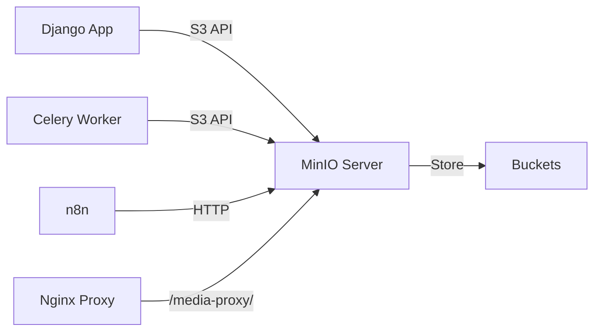

## Overview

Energy CMMS uses MinIO (S3-compatible storage) for storing files, documents, photos, and all user-uploaded content. This provides centralized, scalable storage accessible across all services.

## Architecture



## Configuration

### Environment-Based Setup

The system automatically configures storage based on environment:

<CodeGroup>

```python settings.py - Storage Configuration
# MinIO / S3 Storage Configuration
AWS_ACCESS_KEY_ID = os.environ.get('AWS_ACCESS_KEY_ID', 'rootminio')
AWS_SECRET_ACCESS_KEY = os.environ.get('AWS_SECRET_ACCESS_KEY', 'PasswordRoot07')
AWS_STORAGE_BUCKET_NAME = os.environ.get('AWS_STORAGE_BUCKET_NAME', 'energia-media')

# Environment detection
IS_LOCAL = DEBUG and not os.environ.get('COOLIFY_FQDN')

if IS_LOCAL:
    # Development: Direct access to MinIO
    MEDIA_URL = f'http://181.115.47.107:9000/{AWS_STORAGE_BUCKET_NAME}/'
    AWS_S3_ENDPOINT_URL = 'http://181.115.47.107:9000'
    AWS_S3_CUSTOM_DOMAIN = None
    AWS_S3_URL_PROTOCOL = 'http:'
    AWS_S3_USE_SSL = False
    AWS_QUERYSTRING_AUTH = True  # Signed URLs
else:
    # Production: Proxy through Django to avoid mixed content warnings
    MEDIA_URL = '/media-proxy/'
    AWS_S3_CUSTOM_DOMAIN = 'softcom.ccg.hn/media-proxy'
    AWS_S3_URL_PROTOCOL = 'https:'
    # Internal service name for uploads
    AWS_S3_ENDPOINT_URL = os.environ.get(
        'AWS_S3_ENDPOINT_URL',
        'http://minio-cksckkgkcoogow4o4kg0gsog:9000'
    )
    AWS_S3_USE_SSL = False  # Internal communication
    AWS_QUERYSTRING_AUTH = False

# General S3 configuration
AWS_S3_VERIFY = False
AWS_S3_REGION_NAME = 'us-east-1'
AWS_S3_SIGNATURE_VERSION = 's3v4'
AWS_S3_FILE_OVERWRITE = False
AWS_S3_ADDRESSING_STYLE = 'path'  # Critical for MinIO compatibility
AWS_S3_SECURE_URLS = not IS_LOCAL
```

```python settings.py - Storage Backends
# Django Storage Configuration
STORAGES = {
    "default": {
        "BACKEND": "storages.backends.s3boto3.S3Boto3Storage",
    },
    "staticfiles": {
        "BACKEND": "whitenoise.storage.CompressedManifestStaticFilesStorage",
    },
}
```

```env .env - Development
# MinIO Configuration (Local)
AWS_ACCESS_KEY_ID=rootminio
AWS_SECRET_ACCESS_KEY=PasswordRoot07
AWS_STORAGE_BUCKET_NAME=energia-media
AWS_S3_ENDPOINT_URL=http://181.115.47.107:9000
```

```env .env - Production
# MinIO Configuration (Production)
AWS_ACCESS_KEY_ID=your-access-key
AWS_SECRET_ACCESS_KEY=your-secret-key
AWS_STORAGE_BUCKET_NAME=energia-media
AWS_S3_ENDPOINT_URL=http://minio:9000
```

</CodeGroup>

## Custom Storage Classes

### MinIO Storage Backend

Custom storage class for explicit MinIO configuration:

```python core/storage.py
import os
from django.conf import settings
from storages.backends.s3boto3 import S3Boto3Storage

class MinIOStorage(S3Boto3Storage):
    """
    Clase de almacenamiento personalizada para forzar el uso de MinIO/S3
    independientemente del STORAGE default (util para Planos y otros archivos criticos).
    """
    def __init__(self, *args, **kwargs):
        # Asegurar que tome las credenciales de MinIO aunque el default sea local
        kwargs.setdefault('access_key', getattr(settings, 'AWS_ACCESS_KEY_ID', None))
        kwargs.setdefault('secret_key', getattr(settings, 'AWS_SECRET_ACCESS_KEY', None))
        kwargs.setdefault('bucket_name', getattr(settings, 'AWS_STORAGE_BUCKET_NAME', None))
        kwargs.setdefault('endpoint_url', getattr(settings, 'AWS_S3_ENDPOINT_URL', None))
        kwargs.setdefault('use_ssl', getattr(settings, 'AWS_S3_USE_SSL', True))
        kwargs.setdefault('verify', getattr(settings, 'AWS_S3_VERIFY', False))
        super().__init__(*args, **kwargs)
```

### Using Custom Storage in Models

```python activos/models.py
from core.storage import MinIOStorage
from django.db import models

class Plano(models.Model):
    nombre = models.CharField(max_length=200)
    # Force MinIO storage for critical files
    archivo = models.FileField(
        upload_to='planos/',
        storage=MinIOStorage(),  # Explicit MinIO
        null=True,
        blank=True
    )

class Activo(models.Model):
    nombre = models.CharField(max_length=200)
    # Use default storage (configured in settings)
    foto = models.ImageField(
        upload_to='activos/',
        null=True,
        blank=True
    )
```

## File Upload Handling

### Upload Limits

Configure maximum upload sizes:

```python settings.py
# File upload configuration
DATA_UPLOAD_MAX_MEMORY_SIZE = 10 * 1024 * 1024   # 10 MB (in-memory)
FILE_UPLOAD_MAX_MEMORY_SIZE = 50 * 1024 * 1024   # 50 MB (before streaming)
DATA_UPLOAD_MAX_NUMBER_FIELDS = 100000            # For large forms
```

### Direct Upload to MinIO

For large files, upload directly to MinIO:

```python documentos/views.py
from django.core.files.storage import default_storage
import uuid

def upload_documento(request):
    if request.method == 'POST' and request.FILES.get('archivo'):
        archivo = request.FILES['archivo']
        
        # Generate unique filename
        ext = archivo.name.split('.')[-1]
        filename = f"documentos/{uuid.uuid4()}.{ext}"
        
        # Save to MinIO
        path = default_storage.save(filename, archivo)
        url = default_storage.url(path)
        
        # Create database record
        documento = Documento.objects.create(
            titulo=archivo.name,
            archivo=path
        )
        
        return JsonResponse({
            'id': documento.id,
            'url': url
        })
```

### Signed URLs for Temporary Access

```python
from django.core.files.storage import default_storage
from datetime import timedelta

def get_temporary_url(file_path, expiry_minutes=60):
    """
    Generate a temporary signed URL for file access
    """
    if isinstance(default_storage, S3Boto3Storage):
        from botocore.client import Config
        import boto3
        
        s3_client = boto3.client(
            's3',
            endpoint_url=settings.AWS_S3_ENDPOINT_URL,
            aws_access_key_id=settings.AWS_ACCESS_KEY_ID,
            aws_secret_access_key=settings.AWS_SECRET_ACCESS_KEY,
            config=Config(signature_version='s3v4')
        )
        
        url = s3_client.generate_presigned_url(
            'get_object',
            Params={
                'Bucket': settings.AWS_STORAGE_BUCKET_NAME,
                'Key': file_path
            },
            ExpiresIn=expiry_minutes * 60
        )
        return url
    else:
        return default_storage.url(file_path)
```

## Media Proxy (Production)

### Why Use a Proxy?

In production, direct access to MinIO can cause:
- **Mixed content warnings** (HTTP content on HTTPS site)
- **CORS issues**
- **Exposing internal service names**

### Django Proxy View

```python core/views.py
from django.http import StreamingHttpResponse
import requests

def media_proxy(request, path):
    """
    Proxy requests to MinIO to avoid mixed content warnings
    """
    # Internal MinIO URL
    minio_url = f"{settings.AWS_S3_ENDPOINT_URL}/{settings.AWS_STORAGE_BUCKET_NAME}/{path}"
    
    try:
        # Stream from MinIO
        response = requests.get(minio_url, stream=True, timeout=30)
        
        # Determine content type
        content_type = response.headers.get('Content-Type', 'application/octet-stream')
        
        # Stream response
        streaming_response = StreamingHttpResponse(
            response.iter_content(chunk_size=8192),
            content_type=content_type
        )
        
        # Copy relevant headers
        for header in ['Content-Length', 'Content-Disposition', 'Last-Modified']:
            if header in response.headers:
                streaming_response[header] = response.headers[header]
        
        return streaming_response
        
    except Exception as e:
        return HttpResponse(f"Error: {str(e)}", status=500)
```

### URL Configuration

```python urls.py
from django.urls import path, re_path
from core.views import media_proxy

urlpatterns = [
    # Media proxy for production
    re_path(r'^media-proxy/(?P<path>.*)$', media_proxy, name='media-proxy'),
    # ... other patterns
]
```

## Celery Integration

### Background File Processing

Process files asynchronously:

```python activos/tasks.py
from celery import shared_task
from django.core.files.storage import default_storage
import os

@shared_task(bind=True)
def import_activos_task(self, file_path, file_format):
    """
    Import assets from file stored in MinIO
    """
    try:
        # Read file from MinIO
        with default_storage.open(file_path, 'rb') as f:
            file_content = f.read()
            
        # Process file
        dataset = Dataset().load(file_content, format=file_format)
        
        # ... import logic ...
        
        return {'status': 'completed', 'total': len(dataset)}
        
    finally:
        # Cleanup: Delete temporary file
        if default_storage.exists(file_path):
            default_storage.delete(file_path)
```

## MinIO Administration

### Create Bucket

<Steps>

### Access MinIO Console

1. Navigate to `http://your-minio-url:9001`
2. Login with root credentials
3. Go to **Buckets** > **Create Bucket**

### Configure Bucket

1. Name: `energia-media`
2. Versioning: **Disabled** (unless needed)
3. Object Locking: **Disabled**
4. Click **Create**

### Set Access Policy

1. Select bucket
2. Go to **Access** tab
3. Set policy to **Public** or create custom policy:

```json
{
  "Version": "2012-10-17",
  "Statement": [
    {
      "Effect": "Allow",
      "Principal": {"AWS": "*"},
      "Action": ["s3:GetObject"],
      "Resource": ["arn:aws:s3:::energia-media/*"]
    }
  ]
}
```

### Create Access Keys

1. Go to **Access Keys**
2. Click **Create Access Key**
3. Copy Access Key and Secret Key
4. Update `.env` file

</Steps>

## Troubleshooting

<AccordionGroup>

<Accordion title="SignatureDoesNotMatch error">

**Error:** `The request signature we calculated does not match the signature you provided`

**Solutions:**

1. Verify credentials are correct:
```python
from django.conf import settings
print(settings.AWS_ACCESS_KEY_ID)
print(settings.AWS_SECRET_ACCESS_KEY)
```

2. Ensure signature version is `s3v4`:
```python
AWS_S3_SIGNATURE_VERSION = 's3v4'
```

3. Check addressing style:
```python
AWS_S3_ADDRESSING_STYLE = 'path'  # Required for MinIO
```

</Accordion>

<Accordion title="Connection timeout">

**Symptoms:**
- Uploads hang indefinitely
- `ConnectionTimeout` errors

**Solutions:**

1. Verify MinIO is accessible:
```bash
curl http://minio:9000/minio/health/live
```

2. Check network connectivity:
```bash
ping minio
telnet minio 9000
```

3. Verify endpoint URL:
```python
from django.conf import settings
print(settings.AWS_S3_ENDPOINT_URL)
# Should be: http://minio:9000 (internal) or http://IP:9000 (external)
```

</Accordion>

<Accordion title="Mixed content warnings">

**Error:** Browser blocks HTTP content on HTTPS page

**Solution:** Use media proxy (already configured for production)

```python
# Production configuration
MEDIA_URL = '/media-proxy/'
AWS_S3_CUSTOM_DOMAIN = 'yourdomain.com/media-proxy'
AWS_S3_URL_PROTOCOL = 'https:'
```

Verify proxy is working:
```bash
curl https://yourdomain.com/media-proxy/test-file.pdf
```

</Accordion>

<Accordion title="File not found after upload">

**Check file exists in MinIO:**

```python
from django.core.files.storage import default_storage

# List files in directory
files = default_storage.listdir('documentos/')
print(files)

# Check specific file
exists = default_storage.exists('documentos/file.pdf')
print(f"File exists: {exists}")

# Get file URL
url = default_storage.url('documentos/file.pdf')
print(f"URL: {url}")
```

</Accordion>

</AccordionGroup>

## Best Practices

<CardGroup cols={2}>

<Card title="Use Unique Filenames" icon="fingerprint">
  Always use UUID or timestamp-based filenames to avoid conflicts
</Card>

<Card title="Implement Cleanup" icon="trash">
  Delete temporary files after processing to save storage space
</Card>

<Card title="Enable Versioning" icon="clock-rotate-left">
  For critical documents, enable MinIO versioning for recovery
</Card>

<Card title="Monitor Storage" icon="chart-line">
  Set up alerts for storage usage thresholds
</Card>

</CardGroup>

## Related Resources

<CardGroup cols={2}>

<Card title="n8n Integration" icon="workflow" href="/integration/n8n-automation">
  Process files with n8n workflows
</Card>

<Card title="Celery Tasks" icon="clock" href="/integration/celery-tasks">
  Background file processing
</Card>

</CardGroup>