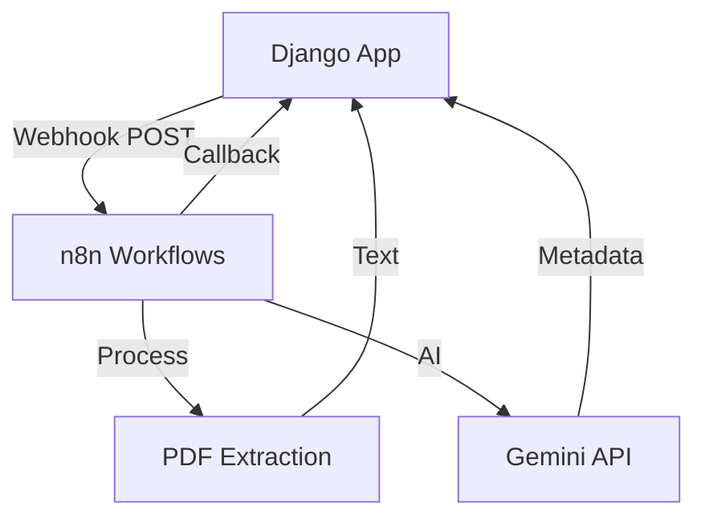

## Overview

Energy CMMS integrates with n8n for powerful workflow automation, including document processing, AI-powered chat, and webhook-based notifications.

## Architecture



## Configuration

### Environment Detection

The system automatically configures n8n URLs based on environment:

<CodeGroup>

```python settings.py - Local Development
# Local environment detection
IS_LOCAL = DEBUG and not os.environ.get('COOLIFY_FQDN')

if IS_LOCAL:
    N8N_BASE_URL = 'http://181.115.47.107:5678'
    N8N_WEBHOOK_URL = f'{N8N_BASE_URL}/webhook-test/nuevo-documento'
    N8N_PROCESS_DOCUMENT_WEBHOOK_URL = f'{N8N_BASE_URL}/webhook-test/process-document'
    N8N_EXTRACT_TEXTO_WEBHOOK_URL = f'{N8N_BASE_URL}/webhook-test/extract-text'
else:
    # Production: Use internal Docker service name
    N8N_BASE_URL = os.environ.get('N8N_INTERNAL_URL', 'http://n8n-z8wscww488scgs84oo4os008:5678')
    N8N_WEBHOOK_URL = f'{N8N_BASE_URL}/webhook/nuevo-documento'
    N8N_PROCESS_DOCUMENT_WEBHOOK_URL = f'{N8N_BASE_URL}/webhook/process-document'
    N8N_EXTRACT_TEXTO_WEBHOOK_URL = f'{N8N_BASE_URL}/webhook/extract-text'
```

```python settings.py - Production
# Container-to-container communication
N8N_INTERNAL_URL = os.environ.get(
    'N8N_INTERNAL_URL',
    'http://n8n-z8wscww488scgs84oo4os008:5678'
)

# Public webhooks
N8N_WEBHOOK_URL = os.environ.get(
    'N8N_WEBHOOK_URL',
    f'{N8N_INTERNAL_URL}/webhook/nuevo-documento'
)

# Document processing webhook
N8N_PROCESS_DOCUMENT_WEBHOOK_URL = os.environ.get(
    'N8N_PROCESS_DOCUMENT_WEBHOOK_URL',
    f'{N8N_INTERNAL_URL}/webhook/process-document'
)

# Text extraction webhook
N8N_EXTRACT_TEXTO_WEBHOOK_URL = os.environ.get(
    'N8N_EXTRACT_TEXTO_WEBHOOK_URL',
    f'{N8N_INTERNAL_URL}/webhook/extract-text'
)

# Chat AI webhook
N8N_CHAT_WEBHOOK_URL = os.environ.get(
    'N8N_CHAT_WEBHOOK_URL',
    f'{N8N_INTERNAL_URL}/webhook/chat-documento'
)

# Material request webhook
N8N_SOLICITUD_WEBHOOK_URL = os.environ.get(
    'N8N_SOLICITUD_WEBHOOK_URL',
    f'{N8N_INTERNAL_URL}/webhook/solicitud-material'
)
```

```env .env
# n8n Configuration
N8N_INTERNAL_URL=http://n8n:5678
N8N_WEBHOOK_URL=http://n8n:5678/webhook/nuevo-documento
N8N_PROCESS_DOCUMENT_WEBHOOK_URL=http://n8n:5678/webhook/process-document
N8N_EXTRACT_TEXTO_WEBHOOK_URL=http://n8n:5678/webhook/extract-text
N8N_CHAT_WEBHOOK_URL=http://n8n:5678/webhook/chat-documento
N8N_SOLICITUD_WEBHOOK_URL=http://n8n:5678/webhook/solicitud-material

# Callback URLs (Django internal URL)
INTERNAL_SITE_URL=http://django:8000
```

</CodeGroup>

## Webhook Implementations

### 1. Document Creation Notification

Notifies n8n when a new document is created:

```python documentos/utils_n8n.py
import requests
import logging
from django.conf import settings

logger = logging.getLogger(__name__)

def notify_n8n_document_created(documento):
    """
    Envía una notificación a n8n cuando se crea un nuevo documento.
    """
    webhook_url = settings.N8N_WEBHOOK_URL
    if not webhook_url:
        logger.info("N8N_WEBHOOK_URL no configurado. Saltando notificación.")
        return False

    try:
        # Preparar datos del documento
        data = {
            'event': 'document_created',
            'id': documento.id,
            'codigo': documento.codigo,
            'titulo': documento.titulo,
            'tipo': documento.tipo_documento.nombre,
            'estado': documento.estado_actual,
            'fecha_creacion': documento.creado_en.isoformat(),
            'url_admin': f"{settings.SITE_URL}/admin/documentos/documento/{documento.id}/change/",
        }

        response = requests.post(webhook_url, json=data, timeout=5)
        response.raise_for_status()
        
        logger.info(f"Notificación enviada a n8n para el documento {documento.codigo}")
        return True
    except Exception as e:
        logger.error(f"Error al enviar notificación a n8n: {e}")
        return False
```

### 2. Document Processing (PDF + Metadata)

Extract text and metadata from documents using AI:

<Steps>

### Django Sends Request

When a document revision is created, Django triggers processing:

```python documentos/tasks.py
@shared_task(name='documentos.tasks.extract_document_metadata')
def extract_document_metadata(revision_id):
    """
    Tarea para extraer texto y metadatos de un documento (PDF, etc.)
    """
    from .models import Revision
    from django.conf import settings
    import requests
    
    try:
        revision = Revision.objects.get(pk=revision_id)
        revision.estado_extraccion = 'PROCESANDO'
        revision.save()

        # Prepare callback URL for n8n to send results back
        base_callback_url = settings.INTERNAL_SITE_URL
        internal_callback_url = f"{base_callback_url}/documentos/api/callback-procesamiento/{revision.id}/"

        payload = {
            'revision_id': revision.id,
            'documento_id': revision.documento.id,
            'filename': os.path.basename(revision.archivo.name),
            'file_url': revision.archivo.url,  # MinIO signed URL
            'file_key': revision.archivo.name,
            'tipo_documento': revision.documento.tipo_documento.nombre,
            'callback_url': internal_callback_url,
            'metadatos_requeridos': list(
                revision.documento.tipo_documento.metadatos_config.values_list('nombre', flat=True)
            )
        }
        
        n8n_url = settings.N8N_PROCESS_DOCUMENT_WEBHOOK_URL
        response = requests.post(n8n_url, json=payload, timeout=10)
        logger.info(f"Revision {revision_id}: Enviada a n8n. Status: {response.status_code}")
        
        return True

    except Exception as e:
        logger.error(f"Error en extract_document_metadata: {str(e)}")
        return False
```

### n8n Processes Document

Create this workflow in n8n:

```json n8n Workflow - Process Document
{
  "name": "Process Document - PDF + Metadata",
  "nodes": [
    {
      "name": "Webhook",
      "type": "n8n-nodes-base.webhook",
      "parameters": {
        "path": "process-document",
        "responseMode": "onReceived"
      }
    },
    {
      "name": "Download PDF",
      "type": "n8n-nodes-base.httpRequest",
      "parameters": {
        "url": "={{$json.file_url}}",
        "method": "GET",
        "responseFormat": "file"
      }
    },
    {
      "name": "Extract Text (PyMuPDF)",
      "type": "n8n-nodes-base.code",
      "parameters": {
        "language": "python",
        "code": "import fitz\n\npdf_data = items[0]['binary']['data']\ndoc = fitz.open(stream=pdf_data)\n\ntext = ''\nfor page in doc:\n    text += page.get_text()\n\nreturn {'texto': text, 'num_pages': len(doc)}"
      }
    },
    {
      "name": "Extract Metadata (Gemini)",
      "type": "n8n-nodes-base.httpRequest",
      "parameters": {
        "url": "https://generativelanguage.googleapis.com/v1beta/models/gemini-pro:generateContent",
        "method": "POST",
        "authentication": "genericCredentialType",
        "headers": {
          "Content-Type": "application/json"
        },
        "body": {
          "contents": [
            {
              "parts": [
                {
                  "text": "Extract these fields from the document: {{$json.metadatos_requeridos}}. Document text: {{$json.texto}}"
                }
              ]
            }
          ]
        }
      }
    },
    {
      "name": "Callback to Django",
      "type": "n8n-nodes-base.httpRequest",
      "parameters": {
        "url": "={{$json.callback_url}}",
        "method": "POST",
        "body": {
          "texto": "={{$json.texto}}",
          "metadata": "={{$json.gemini_response}}",
          "num_paginas": "={{$json.num_pages}}"
        }
      }
    }
  ]
}
```

### Django Receives Results

Handle the callback from n8n:

```python documentos/views.py
from django.views.decorators.csrf import csrf_exempt
from django.http import JsonResponse
import json

@csrf_exempt
def callback_procesamiento(request, revision_id):
    """
    Callback endpoint para recibir resultados de n8n
    """
    if request.method == 'POST':
        try:
            data = json.loads(request.body)
            revision = Revision.objects.get(pk=revision_id)
            
            # Update extracted text
            if 'texto' in data:
                revision.documento.contenido_texto = data['texto']
                revision.documento.save()
            
            # Update metadata
            if 'metadata' in data:
                revision.datos_extraidos = data['metadata']
            
            revision.estado_extraccion = 'COMPLETADO'
            revision.save()
            
            return JsonResponse({'status': 'success'})
        except Exception as e:
            logger.error(f"Error en callback: {e}")
            return JsonResponse({'error': str(e)}, status=500)
    
    return JsonResponse({'error': 'Method not allowed'}, status=405)
```

</Steps>

### 3. AI Chat Integration

Implement document chat with Gemini:

```python documentos/views.py
@csrf_exempt
def chat_documento(request):
    """Send document question to n8n for AI processing"""
    if request.method == 'POST':
        data = json.loads(request.body)
        documento_id = data.get('documento_id')
        pregunta = data.get('pregunta')
        
        documento = Documento.objects.get(pk=documento_id)
        
        payload = {
            'documento_id': documento.id,
            'codigo': documento.codigo,
            'pregunta': pregunta,
            'contexto': documento.contenido_texto[:5000],  # First 5000 chars
            'tipo': documento.tipo_documento.nombre
        }
        
        n8n_url = settings.N8N_CHAT_WEBHOOK_URL
        response = requests.post(n8n_url, json=payload, timeout=30)
        
        return JsonResponse(response.json())
```

## Callback URL Configuration

### Internal vs Public URLs

<CodeGroup>

```python Development
# Django running locally, n8n remote
SITE_URL = 'http://localhost:8000'
INTERNAL_SITE_URL = 'http://181.115.47.107:8000'  # Public IP for n8n to reach
```

```python Production (Docker)
# Container-to-container communication
SITE_URL = 'https://softcom.ccg.hn'
INTERNAL_SITE_URL = 'http://kgogwsw00cwcw8g0wk0gsogg:8000'  # Internal service name
```

```python Production (Coolify)
if os.environ.get('COOLIFY_FQDN'):
    SITE_URL = f"http://{os.environ.get('COOLIFY_FQDN')}"
    INTERNAL_SITE_URL = os.environ.get(
        'INTERNAL_SITE_URL',
        'http://kgogwsw00cwcw8g0wk0gsogg:8000'
    )
```

</CodeGroup>

## Troubleshooting

<AccordionGroup>

<Accordion title="Connection refused to n8n">

**Symptoms:**
- `ConnectionError: Connection refused`
- Webhook calls timeout

**Solutions:**

1. **Verify n8n is running:**
```bash
curl http://n8n:5678/healthz
```

2. **Check network connectivity:**
```bash
# From Django container
ping n8n
telnet n8n 5678
```

3. **Verify environment variables:**
```python
from django.conf import settings
print(settings.N8N_BASE_URL)
print(settings.N8N_WEBHOOK_URL)
```

</Accordion>

<Accordion title="Callback URL incorrect port">

**Error:** n8n tries to callback to wrong port (e.g., `localhost:5000` instead of `localhost:8000`)

**Solution from N8N_DJANGO_SETUP.md:**

1. Open n8n workflow editor
2. Find "Callback to Django" node
3. Change URL from hardcoded value to: `{{$json["callback_url"]}}`
4. Ensure Django sends correct `callback_url` in webhook payload

```python
# Django sends this
payload = {
    'callback_url': f"{settings.INTERNAL_SITE_URL}/documentos/api/callback/{id}/"
}

# n8n uses dynamic value
# URL: {{$json["callback_url"]}}  ← Use this in n8n!
```

</Accordion>

<Accordion title="Webhook not triggering">

**Check webhook registration in n8n:**

1. Go to n8n UI: `http://n8n:5678`
2. Open workflow
3. Verify webhook path matches settings
4. Test webhook:

```bash
curl -X POST http://n8n:5678/webhook/process-document \
  -H "Content-Type: application/json" \
  -d '{
    "revision_id": 1,
    "file_url": "https://example.com/test.pdf",
    "callback_url": "http://django:8000/documentos/api/callback/1/"
  }'
```

</Accordion>

</AccordionGroup>

## Best Practices

<CardGroup cols={2}>

<Card title="Use Async Tasks" icon="clock">
  Always trigger n8n webhooks from Celery tasks, never synchronously
</Card>

<Card title="Implement Timeouts" icon="hourglass">
  Set reasonable timeouts (5-30s) to prevent hanging requests
</Card>

<Card title="Error Logging" icon="file-lines">
  Log all webhook calls and responses for debugging
</Card>

<Card title="Callback Security" icon="shield">
  Use internal URLs for callbacks in production environments
</Card>

</CardGroup>

## Related Resources

<CardGroup cols={2}>

<Card title="Celery Tasks" icon="clock" href="/integration/celery-tasks">
  Configure background task processing
</Card>

<Card title="MinIO Storage" icon="database" href="/integration/minio-storage">
  File storage for document processing
</Card>

</CardGroup>