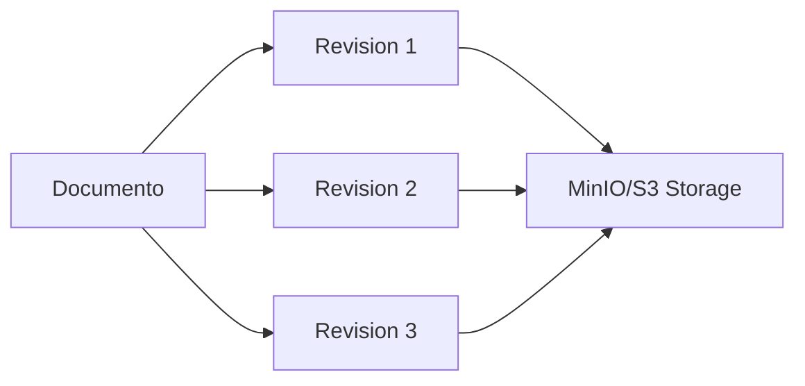

Energy CMMS is an enterprise-grade industrial management system built on Django, designed specifically for power plants and heavy industrial facilities. The platform integrates 12 specialized modules to deliver complete operational control.

## Core Capabilities

<CardGroup cols={2}>
  <Card title="Asset Management" icon="building" href="#asset-management">
    Hierarchical asset tracking with geospatial visualization and complete lifecycle management
  </Card>
  <Card title="Maintenance Operations" icon="tools" href="#maintenance-cmms">
    Full CMMS with preventive/corrective workflows, scheduling, and automated work order generation
  </Card>
  <Card title="Document Control" icon="file-alt" href="#document-management">
    Version-controlled technical documents with AI-powered search and PDF annotation
  </Card>
  <Card title="Safety & Compliance" icon="shield-alt" href="#safety-management">
    Work permits, risk analysis, PPE tracking, and incident management
  </Card>
</CardGroup>

---

## Asset Management

Complete asset lifecycle tracking with advanced visualization and integration capabilities.

### Hierarchical Asset Structure

The system supports unlimited nested location hierarchies (Site → Building → Area → Equipment) with visual tree explorer:

```python
# Example asset hierarchy from activos module
class Ubicacion(models.Model):
    nombre = models.CharField(max_length=200)
    codigo = models.CharField(max_length=50)
    padre = models.ForeignKey('self', on_delete=models.CASCADE)
    tipo = models.CharField(choices=TIPOS_UBICACION)
    orden = models.IntegerField()  # For display ordering
```

<Note>
The explorer supports drag-and-drop reordering and real-time filtering across thousands of assets.
</Note>

### Interactive Floor Plans

- **Geospatial Pin Placement**: Click-to-place assets on technical drawings
- **Photo Pins**: Visual documentation with location markers
- **Multi-layer Support**: Switch between different plan types
- **QR Code Integration**: Mobile scanner for instant asset lookup

### Technical Specifications

Track detailed equipment data including:

- Serial numbers, model, manufacturer (Marca/Modelo catalogs)
- EPC codes and internal asset tags
- Criticality ratings and operational status
- Measurement points (PuntoMedicion) with instrument ranges
- Complete maintenance history linkage

### Mobile Capabilities

Native mobile interface for field operations:

```
📱 Features:
- QR/barcode scanner for instant asset identification
- Offline-capable asset viewer
- Photo capture with automatic geo-tagging
- Quick work order creation from asset context
```

---

## Maintenance (CMMS)

Industrial-strength maintenance management with sophisticated scheduling and execution tracking.

### Preventive Maintenance Routines

Define reusable maintenance procedures with:

<CardGroup cols={3}>
  <Card title="Flexible Frequencies" icon="sync-alt">
    Daily, weekly, monthly, or custom intervals (Frecuencia model: configurable in days)
  </Card>
  <Card title="Detailed Procedures" icon="book">
    Step-by-step checklists with multiple response types (checkbox, numeric, text, measurements)
  </Card>
  <Card title="Auto-Scheduling" icon="calendar-alt">
    Programacion model generates work orders automatically based on calendar rules
  </Card>
</CardGroup>

### Work Order Management

```python
# Core work order structure from mantenimiento/models.py
class OrdenTrabajo(models.Model):
    ESTADOS = [
        ('PENDIENTE', 'Pendiente'),
        ('EN_PROCESO', 'En Proceso'),
        ('COMPLETADA', 'Completada'),
        ('CANCELADA', 'Cancelada')
    ]
    
    numero = models.CharField(max_length=50, unique=True)
    tipo = models.CharField(choices=[('PREVENTIVO', 'Preventivo'), ('CORRECTIVO', 'Correctivo')])
    activo = models.ForeignKey('activos.Activo')
    rutina = models.ForeignKey(Rutina, null=True, blank=True)
    fecha_programada = models.DateField()
    tecnico_asignado = models.ForeignKey('TecnicoPuesto')
    estado = models.CharField(choices=ESTADOS)
```

### Execution & Closure

**CierreOrdenTrabajo** model captures:

- Labor hours (horas_hombre)
- Materials consumed (linked to Inventarios)
- Findings and corrective actions
- Verification signatures
- Failure codes (Falla catalog with hierarchical classification)

### Visual Planning

Interactive Gantt-style scheduler:
- Annual/monthly views with drag-and-drop rescheduling
- Color-coded by discipline (Electrical, Mechanical, Civil)
- Workload balancing across technician groups (TecnicoPuesto)
- Restriction calendar for holidays and blackout periods

<Note>
The system integrates with Celery for background processing of large scheduling operations, ensuring responsive UI even with 10,000+ work orders.
</Note>

---

## Document Management

Enterprise document control system with version tracking and AI-powered capabilities.

### Version Control System



**Revision Model Features:**
- File storage in MinIO with versioned paths
- Automatic PDF text extraction via n8n webhook
- Change tracking with user attribution
- Rollback to previous versions

### AI-Powered Search

The system uses **Google Gemini embeddings** (pgvector integration) for semantic search:

```python
# From energia/settings.py - AI Configuration
GEMINI_API_KEY = os.environ.get('GEMINI_API_KEY')

# Periodic embedding synchronization
CELERY_BEAT_SCHEDULE = {
    'sync-document-embeddings-every-minute': {
        'task': 'documentos.tasks.sync_document_embeddings',
        'schedule': 60.0,
    },
}
```

Search capabilities:
- Natural language queries ("show me all transformer maintenance procedures")
- Full-text search within PDF content
- Metadata filtering (TipoDocumento, Disciplina, date ranges)
- Results ranked by semantic relevance

### PDF Annotation System

**ComentarioDocumento** model enables collaborative review:

- Pin comments to specific coordinates (x, y, page number)
- Thread discussions with multiple replies
- Status tracking (Open, Resolved, Acknowledged)
- Export annotated PDFs with all comments

### Dynamic Metadata

Configurable custom fields per document type via **MetadatoConfig**:

```python
TIPOS_CAMPO = [
    ('TEXTO', 'Text'),
    ('FECHA', 'Date'),
    ('NUMERO', 'Number'),
    ('RELACION', 'Relation to other models'),
]
```

Examples: Expiration dates for certifications, approval numbers, external contractor info.

---

## Budget & Financial Control

Real-time cost tracking integrated with ERP systems.

### Cost Sheet Structure

<CardGroup cols={2}>
  <Card title="Budget Tracking" icon="wallet">
    **PartidaPresupuestaria** tracks:
    - Original budget (presupuesto_original)
    - Committed funds (comprometido)
    - Actual expenses (gastado)
    - Available balance (disponible)
  </Card>
  <Card title="Change Management" icon="exchange-alt">
    **CambioPresupuesto** handles:
    - Transfers between line items
    - Budget additions
    - Reductions with approval workflow
  </Card>
</CardGroup>

### Purchase Requisitions

**Dynamics 365 Integration** for procurement:

```python
# From presupuestos module
class Requisicion(models.Model):
    numero = models.CharField(max_length=50, unique=True)
    estado = models.CharField(choices=ESTADOS_REQUISICION)
    fecha_creacion = models.DateTimeField(auto_now_add=True)
    solicitante = models.ForeignKey(User)
    partida = models.ForeignKey(PartidaPresupuestaria)
    
    # Sync status with ERP
    sincronizado = models.BooleanField(default=False)
    ultima_sync = models.DateTimeField(null=True)
```

Features:
- Wizard-based requisition creation flow
- Background sync with Dynamics 365 via Celery tasks
- Automatic budget encumbrance
- Approval routing based on amount thresholds
- PDF generation for signatures

### Executive Dashboards

**PresupuestoAgrupado** model provides rolled-up financial views:
- Budget vs. actual by discipline
- Monthly burn rate analysis
- Commitment tracking (purchase orders, contracts)
- Variance reporting

---

## Inventory & Warehouse

Multi-location material control with traceability.

### Stock Management

```python
# From inventarios/models.py
class StockRecord(models.Model):
    material = models.ForeignKey(Material)
    ubicacion = models.ForeignKey('almacen.Almacen')
    lote = models.ForeignKey(Lote, null=True)
    cantidad = models.DecimalField(max_digits=10, decimal_places=2)
    costo_unitario = models.DecimalField(max_digits=10, decimal_places=2)
```

### Material Movement Tracking

**MovimientoInventario** records all transactions:

- **Entradas**: Purchases, returns, transfers-in
- **Salidas**: Consumption, scrap, transfers-out
- **Ajustes**: Physical count corrections

Each movement links to source documents (Requisicion, OrdenTrabajo, etc.)

### Work Order Material Liquidation

Technicians request materials via **SolicitudMaterial**:
1. Create request linked to work order
2. Warehouse approves and issues stock
3. Movement automatically debits stock
4. Costs post to maintenance cost center

### Compatibility Matrix

**CompatibilidadMaterial** model defines interchangeable parts:
```python
# Track approved substitutions
material_original = models.ForeignKey(Material, related_name='compatible_con')
material_alternativo = models.ForeignKey(Material, related_name='es_alternativo_de')
notas = models.TextField()
```

---

## Safety Management

Comprehensive safety system for high-risk industrial operations.

### Work Permit System

**PermisoTrabajo** supports multiple permit types:

<CardGroup cols={3}>
  <Card title="Hot Work" icon="fire">
    Welding, cutting, grinding with fire watch requirements
  </Card>
  <Card title="Confined Space" icon="door-closed">
    Gas testing, rescue equipment, entry supervisor
  </Card>
  <Card title="Lockout/Tagout" icon="lock">
    Energy isolation with multi-signature verification
  </Card>
</CardGroup>

Each permit type has configurable **RequisitoPermiso** checklists:

```python
class VerificacionRequisito(models.Model):
    permiso = models.ForeignKey(PermisoTrabajo)
    requisito = models.ForeignKey(RequisitoPermiso)
    cumplido = models.BooleanField()
    verificado_por = models.ForeignKey(User)
    fecha_verificacion = models.DateTimeField(auto_now=True)
    observaciones = models.TextField()
```

### Job Safety Analysis (JSA/AST)

**AnalisisRiesgo** model enables pre-job hazard identification:

- Break work into steps (**PasoTrabajo**)
- Identify hazards per step (**Riesgo** with severity ratings)
- Define controls (**Control** linked to each risk)
- Approval workflow before permit issuance

### PPE Tracking

**AsignacionEPP** manages personal protective equipment:

- Assignment to workers with size/type
- Expiration date tracking
- Inspection schedules
- Replacement workflow when damaged

### Incident Management

**Incidente** model for event recording:
- Incident classification (TipoIncidente: Near miss, First aid, Lost time, etc.)
- Root cause analysis fields
- Corrective action tracking
- Photo evidence (FotoIncidente)
- Investigation workflow with notifications

---

## Project Management

Track capital projects and improvement initiatives.

### Project Structure

```python
# From proyectos/models.py
class Proyecto(models.Model):
    codigo = models.CharField(max_length=50)  # Auto: PROY-2026-0001
    nombre = models.CharField(max_length=200)
    estado = models.CharField(choices=[
        ('PLANIFICACION', 'Planning'),
        ('EN_CURSO', 'In Progress'),
        ('COMPLETADO', 'Completed'),
        ('SUSPENDIDO', 'Suspended')
    ])
    responsable = models.ForeignKey(User)
    fecha_inicio = models.DateField()
    fecha_fin = models.DateField()
    presupuesto_aprobado = models.DecimalField()
```

### Activity Management

**Actividad** model with dependency tracking:

- Predecessor activities (predecesoras field for Gantt logic)
- Priority levels (Alta, Media, Baja)
- Location pinning on floor plans
- Document attachments via **DocumentoProyecto**

### Visual Scheduling

Interactive Gantt chart features:
- Critical path highlighting
- Progress percentage tracking
- Resource loading by responsible user
- Milestone markers

### AI Assistant Integration

The module includes a **Gemini-powered chatbot** for:
- Schedule optimization suggestions
- Risk identification from project description
- Similar project lookup for estimation

---

## Communications & Transmittals

Formal communication tracking for document exchanges.

### Transmittal System

**Comunicado** model supports email-style internal communications:

```python
class Comunicado(models.Model):
    consecutivo = models.CharField(max_length=50, unique=True)  # Auto-generated
    tipo = models.ForeignKey(TipoComunicado)  # RFI, MEMO, Transmittal
    asunto = models.CharField(max_length=200)
    cuerpo = models.TextField()
    remitente = models.ForeignKey(User)
    estado = models.CharField(choices=[('BORRADOR', 'Draft'), ('ENVIADO', 'Sent')])
    fecha_envio = models.DateTimeField(null=True)
    padre = models.ForeignKey('self', null=True)  # For threading
```

### Recipient Tracking

**Destinatario** model with read receipts:

- Para/CC/BCC classification
- Read timestamp tracking
- Reply/forward handling
- Notification integration

### Attachments

**AdjuntoComunicado** supports multiple attachment types:

- PDF documents (links to Documento model)
- Assets (links to Activo)
- Generic file uploads

### API Integration

REST endpoints for external systems:
- `POST /comunicaciones/api/transmittals/create/`
- `GET /comunicaciones/api/transmittals/received/`
- `GET /comunicaciones/api/transmittals/{id}/history/`

---

## Audit & Quality Control

Physical verification and compliance tracking.

### Audit Planning

**Auditoria** model organizes verification campaigns:

```python
tipo_choices = [
    ('INVENTARIO', 'Asset Inventory'),
    ('CALIBRACION', 'Calibration'),
    ('SEGURIDAD', 'Safety Compliance'),
    ('CALIDAD', 'Quality Inspection')
]
```

### Mobile Audit Execution

**ResultadoAuditoria** records field findings:

- QR/RFID scanning for asset identification
- Photo evidence capture
- Discrepancy logging (expected vs. actual)
- GPS coordinates
- Inspector signature

### Reconciliation Workflow

Post-audit synchronization:
1. Review discrepancies
2. Approve/reject adjustments
3. Trigger MovimientoInventario for stock corrections
4. Update asset locations in Activos module

---

## Call Center / Ticketing

Internal service desk for operational requests.

### Ticket Management

**SolicitudTicket** model for user-submitted issues:

```python
# From callcenter/models.py
class SolicitudTicket(models.Model):
    numero = models.CharField(max_length=50, unique=True)
    tipo = models.CharField(choices=[
        ('M1', 'Service Request'),
        ('M2', 'Breakdown/Failure')
    ])
    activo = models.ForeignKey('activos.Activo', null=True)
    ubicacion = models.ForeignKey('activos.Ubicacion', null=True)
    descripcion = models.TextField()
    solicitante = models.ForeignKey(User)
    estado = models.CharField(choices=ESTADOS)
```

### External System Integration

**Background sync with SIG (external ticketing)**:

- Celery task: `callcenter.tasks.sync_tickets_from_sig()`
- Web scraping connector (callcenter/scraper.py)
- Bidirectional status updates
- Attachment synchronization

### Escalation to Work Orders

One-click conversion from ticket to **OrdenTrabajo**:
- Pre-fill asset, location, description
- Assign technician based on grupo rules
- Link ticket for traceability

---

## Energy Consumption Monitoring

Utility tracking specialized for power plant operations.

### Metering Infrastructure

**Medidor** model supports hierarchical meter relationships:

```python
# From core/models.py
class Medidor(models.Model):
    codigo = models.CharField(max_length=50, unique=True)
    descripcion = models.CharField(max_length=200)
    tipo = models.ForeignKey(TipoMedidor)  # Eléctrico, Agua, Gas, etc.
    unidad = models.ForeignKey(UnidadMedida)
    medidor_padre = models.ForeignKey('self', null=True)  # For sub-meters
    activo = models.ForeignKey('activos.Activo', null=True)
```

### Data Import

**InterfaceConsumo** staging table for Excel imports:

- Validation against meter catalog
- Duplicate detection
- Delta calculation (reading difference)
- Bulk insert to **Consumo** model

### Reporting

Built-in reports:
- Monthly consumption by meter type
- Daily usage trends
- Delta analysis (sudden spikes/drops)
- Cost allocation by department

---

## Integration Architecture

Energy CMMS is designed for enterprise integration with external systems.

### Storage Backend

**MinIO/S3 Integration** via django-storages:

```python
# From energia/settings.py
AWS_S3_ENDPOINT_URL = os.environ.get('AWS_S3_ENDPOINT_URL')
AWS_STORAGE_BUCKET_NAME = 'energia-media'
AWS_S3_ADDRESSING_STYLE = 'path'  # MinIO compatibility

STORAGES = {
    "default": {
        "BACKEND": "storages.backends.s3boto3.S3Boto3Storage",
    },
}
```

All file uploads (documents, photos, attachments) are stored in object storage with automatic failover.

### n8n Automation Platform

**Webhook integrations** for AI workflows:

<CardGroup cols={2}>
  <Card title="Document Processing" icon="file-pdf">
    `N8N_PROCESS_DOCUMENT_WEBHOOK_URL`
    - PDF text extraction
    - Metadata inference
    - Embedding generation
  </Card>
  <Card title="AI Chat" icon="comments">
    `N8N_CHAT_WEBHOOK_URL`
    - Conversational interface
    - Context-aware responses
    - History tracking (N8nChatHistory model)
  </Card>
</CardGroup>

### ERP Integration

**Dynamics 365 Connector**:

- Requisition sync (presupuestos.dynamics_utils module)
- Budget data import
- Purchase order status updates
- Vendor master data

### Background Processing

**Celery + Redis** for asynchronous operations:

```python
# Configured in energia/settings.py
CELERY_BROKER_URL = os.environ.get('CELERY_BROKER_URL', 'redis://localhost:6379/0')
CELERY_RESULT_BACKEND = 'django-db'
CELERY_TASK_TIME_LIMIT = 30 * 60  # 30 minutes max per task
```

Use cases:
- Large data imports (activos, mantenimiento)
- Report generation
- Email notifications
- Scheduled maintenance generation

---

## Technical Stack

<Note>
Energy CMMS is built on modern, proven technologies for reliability and scalability.
</Note>

### Core Framework

- **Django 5.1.7** - Python web framework
- **PostgreSQL** - Primary database with pgvector extension
- **Redis** - Cache and message broker
- **Celery** - Distributed task queue

### Key Packages

| Package | Purpose |
|---------|---------|
| `django-storages` | S3/MinIO integration |
| `django-import-export` | Excel/CSV data handling |
| `jazzmin` | Enhanced admin interface |
| `django-cors-headers` | API CORS management |
| `whitenoise` | Static file serving |
| `pgvector` | Vector embeddings for AI search |

### Deployment

Designed for **Coolify** containerized deployment:

```python
# Environment-aware configuration
IS_LOCAL = DEBUG and not os.environ.get('COOLIFY_FQDN')

if IS_LOCAL:
    DATABASE_HOST = '127.0.0.1'  # Local tunnel
else:
    DATABASE_HOST = 'postgres-service'  # Docker network
```

Features:
- Automatic ALLOWED_HOSTS configuration
- Dynamic CSRF_TRUSTED_ORIGINS
- Proxy SSL header support
- Internal/external URL routing

---

## Customization & Extensibility

The system is designed for easy customization to meet specific operational needs.

### Custom Fields

**MetadatoConfig** system allows administrators to add custom fields without code changes:

1. Define field in admin interface
2. Select field type (text, date, number, relation)
3. Fields automatically appear in document forms
4. Searchable and filterable in queries

### User Interface

**ConfiguracionUI** model (core app) enables per-user customization:

- Theme color selection (ColorField)
- Logo upload
- Dashboard widget arrangement
- Default module landing pages

### Workflow Customization

Many models include **estado** (status) fields with configurable workflows:

- Add custom status values
- Define transition rules
- Configure notifications per state change
- Restrict actions based on user groups

### Reporting

Built-in report templates with parameters:
- Date range selection
- Multi-select filters (activo, ubicacion, responsable)
- Export to PDF/Excel
- Schedule automatic email delivery

### API Access

Django REST Framework endpoints for external integrations:
- Token-based authentication
- JSON request/response
- Pagination and filtering
- Comprehensive error handling

---

## Mobile-First Design

Critical features optimized for field operations.

### Responsive Admin Interface

Jazzmin theme provides mobile-friendly Django admin:
- Touch-optimized navigation
- Collapsible sidebar
- Responsive tables with horizontal scroll
- Image upload from camera

### Dedicated Mobile Views

Specialized mobile interfaces:

```
Routes (from core/urls.py):
/mobile/dashboard/     - Field technician home
/mobile/activos/       - Asset quick lookup  
/mobile/qr-scanner/    - Camera-based scanner
/mobile/ordenes/       - My open work orders
```

### Progressive Web App (PWA) Capabilities

- Offline mode for asset viewing
- Service worker for data sync
- Install prompt for home screen
- Push notifications for assignments

---

## Security & Compliance

Enterprise-grade security features for industrial environments.

### Authentication & Authorization

- **Django's built-in auth** with Groups and Permissions
- **PerfilUsuario** extends User model with organizational data
- Granular permissions per model action (view, add, change, delete)
- IP whitelisting support via ALLOWED_HOSTS

### Audit Trail

Comprehensive logging:

- **AuditoriaFirmas** for document signatures
- **MovimientoInventario** tracks all stock changes
- Django admin history for all model changes
- Celery task logging for background operations

### Data Protection

- **CSRF protection** enabled globally
- **XSS prevention** via Django templates
- **SQL injection protection** via ORM
- **File upload validation** by extension and MIME type

### Compliance

Alignment with industrial standards:

- ISO 55000 (Asset Management)
- ISO 14224 (Equipment Reliability Data)
- OSHA 1910 (Safety Standards)
- SOC 2 Type II ready architecture

---

## Performance Optimization

Built to handle large-scale industrial data.

### Database Optimization

```python
# Strategic indexes on high-traffic models
class Activo(models.Model):
    codigo_interno = models.CharField(db_index=True)
    ubicacion = models.ForeignKey(Ubicacion, db_index=True)
    
    class Meta:
        indexes = [
            models.Index(fields=['ubicacion', 'estado']),
            models.Index(fields=['fecha_creacion']),
        ]
```

### Caching Strategy

- Redis-backed Django cache
- Template fragment caching for complex widgets
- Database query result caching (1-5 minute TTL)
- Static file caching via WhiteNoise

### Background Jobs

Offload heavy operations to Celery:

- ✅ Import 10,000+ rows from Excel
- ✅ Generate PDF reports with charts
- ✅ Sync with external ERP systems
- ✅ Process document embeddings

### File Storage

MinIO object storage advantages:

- Unlimited scalability
- CDN-ready URLs
- Automatic backups
- Lifecycle policies for old documents

---

## Getting Started

Ready to deploy Energy CMMS? Check the [Installation Guide](/installation) and [Architecture Overview](/architecture) to understand the system design.

<CardGroup cols={2}>
  <Card title="Installation" icon="download" href="/installation">
    Step-by-step deployment instructions
  </Card>
  <Card title="Architecture" icon="diagram-project" href="/architecture">
    System design and component overview
  </Card>
</CardGroup>
