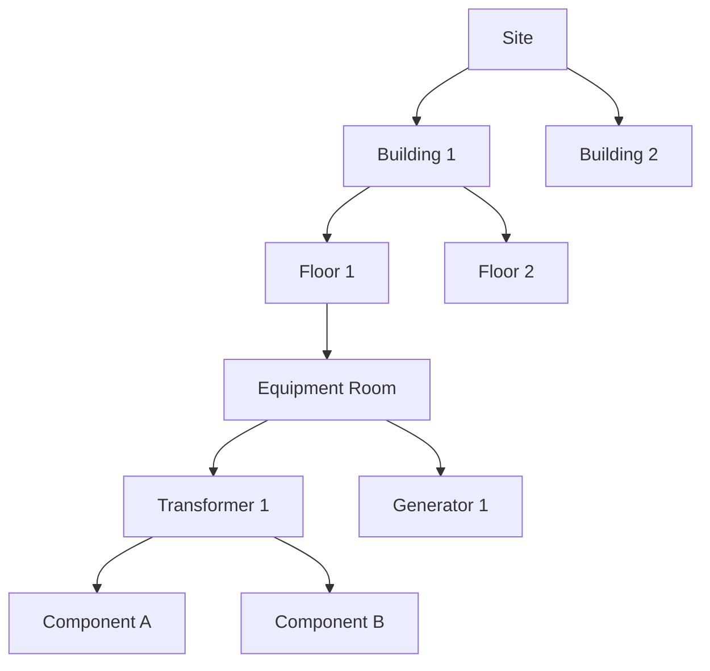

## Overview

The Asset Management module provides complete control over your facility's physical assets, equipment, and technical locations. It supports hierarchical organization, interactive floor plans, QR code integration, and mobile access.

<Note>
The assets module is the foundation for maintenance, inventory, and document management operations.
</Note>

## Key Features

<CardGroup cols={2}>
  <Card title="Hierarchical Organization" icon="sitemap">
    Organize assets in parent-child relationships with unlimited depth
  </Card>
  <Card title="Interactive Floor Plans" icon="map">
    Visualize asset locations on technical drawings with pin markers
  </Card>
  <Card title="QR Code Integration" icon="qrcode">
    Generate and scan QR codes for rapid asset identification
  </Card>
  <Card title="Mobile Access" icon="mobile">
    Access asset information from mobile devices in the field
  </Card>
  <Card title="Import/Export" icon="file-import">
    Bulk operations with Excel import and export capabilities
  </Card>
  <Card title="Document Linking" icon="link">
    Associate technical documents, manuals, and drawings
  </Card>
</CardGroup>

## Data Model

### Activo (Asset)

The core entity representing physical equipment and facilities.

```python activos/models.py
class Activo(models.Model):
    codigo_interno = models.CharField(max_length=50, unique=True)
    descripcion = models.CharField(max_length=255)
    epc = models.CharField(max_length=50, blank=True, null=True)
    serie = models.CharField(max_length=100, blank=True, null=True)
    
    # Hierarchy
    activo_padre = models.ForeignKey('self', on_delete=models.SET_NULL, 
                                     null=True, blank=True, 
                                     related_name='activos_hijos')
    ubicacion = models.ForeignKey('Ubicacion', on_delete=models.PROTECT)
    
    # Classification
    categoria = models.ForeignKey('Categoria', on_delete=models.SET_NULL)
    familia = models.ForeignKey('Familia', on_delete=models.SET_NULL)
    marca = models.ForeignKey('Marca', on_delete=models.SET_NULL)
    modelo = models.ForeignKey('Modelo', on_delete=models.SET_NULL)
    
    # Status
    estado = models.CharField(max_length=20, choices=ESTADO_CHOICES)
    responsable = models.ForeignKey(User, on_delete=models.SET_NULL)
    
    # Technical data
    fecha_instalacion = models.DateField(blank=True, null=True)
    peso = models.DecimalField(max_digits=10, decimal_places=2)
    foto = models.ImageField(upload_to='activos/', blank=True)
```

### Ubicacion (Location)

Hierarchical technical locations for organizing assets.

```python activos/models.py
class Ubicacion(models.Model):
    codigo = models.CharField(max_length=50, unique=True)
    nombre = models.CharField(max_length=255)
    descripcion = models.TextField(blank=True)
    
    # Hierarchy
    padre = models.ForeignKey('self', on_delete=models.CASCADE, 
                             null=True, blank=True,
                             related_name='hijos')
    
    # Type classification
    tipo = models.CharField(max_length=20, choices=TIPO_CHOICES)
    # SITIO, EDIFICIO, AREA, SISTEMA, SUBSISTEMA
    
    # Display order
    orden = models.IntegerField(default=0)
```

## Asset Hierarchy

### Tree Structure

Assets are organized in a multi-level hierarchy:



### Location Types

<Accordion title="SITIO (Site)">
Top-level location representing the entire facility or plant.
</Accordion>

<Accordion title="EDIFICIO (Building)">
Physical buildings or structures within the site.
</Accordion>

<Accordion title="AREA (Area)">
Functional areas or zones within buildings.
</Accordion>

<Accordion title="SISTEMA (System)">
Technical systems (electrical, HVAC, etc.).
</Accordion>

<Accordion title="SUBSISTEMA (Subsystem)">
Subsystems and equipment groups.
</Accordion>

## Interactive Floor Plans

### VisorPlano (Plan Viewer)

Visual representation of assets on technical drawings.

```python activos/models.py
class VisorPlano(models.Model):
    nombre = models.CharField(max_length=100)
    ubicacion = models.ForeignKey('Ubicacion', on_delete=models.CASCADE)
    imagen_plano = models.ImageField(upload_to='planos/')
    orden = models.IntegerField(default=0)
```

### PinPlano (Floor Plan Pins)

Asset markers on floor plans with coordinates.

```python activos/models.py
class PinPlano(models.Model):
    visor = models.ForeignKey('VisorPlano', on_delete=models.CASCADE)
    activo = models.ForeignKey('Activo', on_delete=models.CASCADE)
    
    # Coordinates (percentage)
    x = models.FloatField()  # 0-100
    y = models.FloatField()  # 0-100
    
    # Visual appearance
    icon = models.CharField(max_length=50, default='map-marker')
    color = ColorField(default='#FF0000')
```

## QR Code Integration

### Generating QR Codes

Assets automatically generate QR codes linking to their detail page:

```python activos/models.py
def generar_qr(self):
    qr = qrcode.QRCode(version=1, box_size=10, border=5)
    url = f"{settings.SITE_URL}/activos/{self.codigo_interno}/"
    qr.add_data(url)
    qr.make(fit=True)
    
    img = qr.make_image(fill_color="black", back_color="white")
    return img
```

### Mobile Scanner

Scan QR codes to quickly access asset information:

```javascript Mobile Scanner
// Scan QR code and navigate to asset detail
const scanAsset = async () => {
  const result = await BarcodeScanner.scan();
  if (result.format === 'QR_CODE') {
    navigation.navigate('AssetDetail', {
      codigo: extractCodigoFromURL(result.text)
    });
  }
};
```

## Import/Export

### Excel Import Format

Bulk asset import from Excel files:

```csv assets_import.csv
codigo_interno,descripcion,ubicacion,categoria,estado,responsable
EQ-001,"Main Transformer",SITE-01/ELEC,Electrical,OPERATIVO,admin
EQ-002,"Backup Generator",SITE-01/ELEC,Electrical,STANDBY,admin
EQ-003,"Cooling Tower 1",SITE-01/HVAC,HVAC,OPERATIVO,maint_user
```

### Background Import Process

Large imports are processed asynchronously with Celery:

```python activos/tasks.py
@shared_task(bind=True)
def import_activos_async(self, file_id, user_id):
    from activos.resources import ActivoResource
    
    registro = RegistroImportacion.objects.get(id=file_id)
    resource = ActivoResource()
    
    # Process in chunks
    dataset = Dataset().load(registro.archivo.read(), format='xlsx')
    total = len(dataset)
    
    for i, row in enumerate(dataset.dict):
        # Import each row
        resource.import_row(row)
        
        # Update progress
        self.update_state(
            state='PROGRESS',
            meta={'current': i + 1, 'total': total}
        )
    
    registro.estado = 'COMPLETED'
    registro.save()
```

## API Endpoints

<Card title="Asset Search" icon="magnifying-glass" href="/api/assets#asset-search">
Search assets with filtering, pagination, and location hierarchy
</Card>

<Card title="Asset Details" icon="circle-info" href="/api/assets#asset-details">
Retrieve complete asset information including related records
</Card>

<Card title="Floor Plan Pins" icon="map-pin" href="/api/assets#floor-plan-management">
Manage asset pins on interactive floor plans
</Card>

## Best Practices

<Tip>
**Naming Convention**: Use consistent prefixes for asset codes (e.g., `EQ-` for equipment, `SYS-` for systems)
</Tip>

<Warning>
**Parent-Child Relationships**: Avoid circular references in asset hierarchy
</Warning>

<Note>
**QR Code Labels**: Print QR code labels with asset codes for easy field identification
</Note>

## Related Modules

<CardGroup cols={3}>
  <Card title="Maintenance" icon="wrench" href="/modules/maintenance">
    Schedule work on assets
  </Card>
  <Card title="Documents" icon="file" href="/modules/documents">
    Link technical documents
  </Card>
  <Card title="Inventory" icon="box" href="/modules/inventory">
    Track spare parts
  </Card>
</CardGroup>
