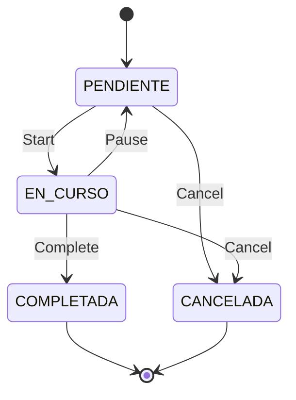

## Overview

The Maintenance module is a complete Computerized Maintenance Management System (CMMS) that handles preventive maintenance routines, work orders, scheduling, and technician management.

<Note>
This module integrates tightly with Assets, Inventory, and Safety modules for complete operational control.
</Note>

## Key Features

<CardGroup cols={2}>
  <Card title="Preventive Maintenance" icon="calendar-check">
    Automated scheduling based on frequency and calendars
  </Card>
  <Card title="Work Orders" icon="clipboard-list">
    Complete work order lifecycle from creation to closure
  </Card>
  <Card title="Visual Scheduler" icon="calendar">
    Interactive Gantt chart for planning and execution
  </Card>
  <Card title="Mobile Execution" icon="mobile">
    Execute work orders from mobile devices
  </Card>
  <Card title="Procedures" icon="list-check">
    Step-by-step checklists with validation
  </Card>
  <Card title="Resource Planning" icon="users">
    Technician assignment and workload balancing
  </Card>
</CardGroup>

## Data Model

### Rutina (Routine)

Template for preventive maintenance activities:

```python mantenimiento/models.py
class Rutina(models.Model):
    nombre = models.CharField(max_length=200)
    descripcion = models.TextField()
    
    # Target
    activo = models.ForeignKey('activos.Activo', on_delete=models.CASCADE)
    ubicacion = models.ForeignKey('activos.Ubicacion', on_delete=models.SET_NULL)
    
    # Classification
    categoria = models.ForeignKey('Categoria', on_delete=models.PROTECT)
    frecuencia = models.ForeignKey('Frecuencia', on_delete=models.PROTECT)
    
    # Execution
    duracion_estimada = models.DurationField()
    procedimiento = models.ForeignKey('Procedimiento', on_delete=models.SET_NULL)
    
    # Status
    activo = models.BooleanField(default=True)
```

### OrdenTrabajo (Work Order)

Executable maintenance tasks:

```python mantenimiento/models.py
class OrdenTrabajo(models.Model):
    ESTADOS = [
        ('PENDIENTE', 'Pendiente'),
        ('EN_CURSO', 'En Curso'),
        ('COMPLETADA', 'Completada'),
        ('CANCELADA', 'Cancelada'),
    ]
    
    codigo = models.CharField(max_length=50, unique=True)
    descripcion = models.TextField()
    
    # Source
    rutina = models.ForeignKey('Rutina', on_delete=models.SET_NULL)
    aviso = models.ForeignKey('Aviso', on_delete=models.SET_NULL)
    
    # Scheduling
    fecha_programada = models.DateField()
    fecha_inicio = models.DateTimeField(blank=True, null=True)
    fecha_fin = models.DateTimeField(blank=True, null=True)
    
    # Assignment
    tecnico = models.ForeignKey('TecnicoPuesto', on_delete=models.SET_NULL)
    empresa = models.ForeignKey('Empresa', on_delete=models.SET_NULL)
    
    # Status
    estado = models.CharField(max_length=20, choices=ESTADOS)
```

## Preventive Maintenance

### Frequency Configuration

Define maintenance intervals:

<Tabs>
  <Tab title="Time-Based">
    ```python
    Frecuencia.objects.create(
        nombre="Monthly",
        dias=30,
        tipo="CALENDARIO"
    )
    ```
  </Tab>
  <Tab title="Meter-Based">
    ```python
    Frecuencia.objects.create(
        nombre="Every 1000 hours",
        valor_medidor=1000,
        tipo="CONTADOR"
    )
    ```
  </Tab>
  <Tab title="Fixed Dates">
    ```python
    Frecuencia.objects.create(
        nombre="Annual - January",
        meses_especificos=[1],
        tipo="ANUAL"
    )
    ```
  </Tab>
</Tabs>

### Automatic Work Order Generation

Work orders are generated automatically based on routines:

```python mantenimiento/tasks.py
@shared_task
def generar_ordenes_preventivas():
    """Generate work orders for active routines"""
    from mantenimiento.services import ProgramacionService
    
    # Get active routines
    rutinas = Rutina.objects.filter(activo=True)
    
    for rutina in rutinas:
        # Check if work order is needed
        if ProgramacionService.necesita_orden(rutina):
            # Calculate next date
            fecha = ProgramacionService.calcular_fecha(rutina)
            
            # Create work order
            OrdenTrabajo.objects.create(
                rutina=rutina,
                descripcion=rutina.nombre,
                fecha_programada=fecha,
                estado='PENDIENTE'
            )
```

## Work Order Lifecycle

### State Machine



### Execution Steps

<Steps>
  <Step title="Start Work Order">
    Technician starts the work order, logging start time
    
    ```python
    orden.estado = 'EN_CURSO'
    orden.fecha_inicio = timezone.now()
    orden.save()
    ```
  </Step>
  
  <Step title="Execute Procedure">
    Follow procedure steps and record results
    
    ```python
    for paso in orden.procedimiento.pasos.all():
        ValorPasoOrden.objects.create(
            orden=orden,
            paso=paso,
            valor=technician_input
        )
    ```
  </Step>
  
  <Step title="Record Resources">
    Log hours worked and materials consumed
    
    ```python
    CierreOrdenTrabajo.objects.create(
        orden=orden,
        horas_hombre=8.5,
        materiales_usados=[...]
    )
    ```
  </Step>
  
  <Step title="Complete Order">
    Mark work order as completed
    
    ```python
    orden.estado = 'COMPLETADA'
    orden.fecha_fin = timezone.now()
    orden.save()
    ```
  </Step>
</Steps>

## Visual Scheduler

### Cronogram View

Interactive calendar for planning maintenance:

```python mantenimiento/views.py
def cronograma_view(request):
    """Display maintenance schedule"""
    mes = request.GET.get('mes', timezone.now().month)
    anio = request.GET.get('anio', timezone.now().year)
    
    # Get work orders for period
    ordenes = OrdenTrabajo.objects.filter(
        fecha_programada__year=anio,
        fecha_programada__month=mes
    ).select_related('rutina', 'tecnico')
    
    # Group by week
    calendario = {}
    for orden in ordenes:
        semana = orden.fecha_programada.isocalendar()[1]
        if semana not in calendario:
            calendario[semana] = []
        calendario[semana].append(orden)
    
    return render(request, 'cronograma.html', {
        'calendario': calendario,
        'mes': mes,
        'anio': anio
    })
```

### Drag-and-Drop Rescheduling

Move work orders by dragging in the calendar:

```javascript
// Update work order date via AJAX
function rescheduleOrder(orderId, newDate) {
  fetch(`/mantenimiento/ordenes/${orderId}/reschedule/`, {
    method: 'POST',
    headers: {
      'Content-Type': 'application/json',
      'X-CSRFToken': getCookie('csrftoken')
    },
    body: JSON.stringify({ fecha_programada: newDate })
  });
}
```

## Procedures and Checklists

### Procedimiento (Procedure)

Step-by-step instructions for maintenance tasks:

```python mantenimiento/models.py
class Procedimiento(models.Model):
    nombre = models.CharField(max_length=200)
    descripcion = models.TextField()
    version = models.CharField(max_length=20)
    
class PasoProcedimiento(models.Model):
    TIPOS = [
        ('CHECK', 'Checkbox'),
        ('NUMERIC', 'Numeric Value'),
        ('TEXT', 'Text Input'),
        ('MEDICION', 'Measurement'),
    ]
    
    procedimiento = models.ForeignKey('Procedimiento', on_delete=models.CASCADE)
    numero = models.IntegerField()
    descripcion = models.TextField()
    tipo_respuesta = models.CharField(max_length=20, choices=TIPOS)
    
    # Validation
    valor_minimo = models.FloatField(blank=True, null=True)
    valor_maximo = models.FloatField(blank=True, null=True)
    obligatorio = models.BooleanField(default=True)
```

## Corrective Maintenance

### Aviso (Maintenance Notice)

User-reported issues that trigger corrective maintenance:

```python mantenimiento/models.py
class Aviso(models.Model):
    TIPOS = [
        ('M1', 'Service Request'),
        ('M2', 'Breakdown'),
    ]
    
    tipo = models.CharField(max_length=2, choices=TIPOS)
    activo = models.ForeignKey('activos.Activo', on_delete=models.CASCADE)
    descripcion = models.TextField()
    reportado_por = models.ForeignKey(User, on_delete=models.SET_NULL)
    fecha_reporte = models.DateTimeField(auto_now_add=True)
    
    # Classification
    falla = models.ForeignKey('Falla', on_delete=models.SET_NULL)
    prioridad = models.CharField(max_length=20)
```

### Notification System

Automatic notifications when maintenance is needed:

```python mantenimiento/models.py
@receiver(post_save, sender=Aviso)
def notify_maintenance_team(sender, instance, created, **kwargs):
    if created and instance.prioridad == 'ALTA':
        # Send email to maintenance team
        send_mail(
            subject=f'Urgent: {instance.tipo} - {instance.activo}',
            message=instance.descripcion,
            recipient_list=['maintenance@example.com']
        )
```

## API Endpoints

<CardGroup cols={2}>
  <Card title="Work Orders" icon="list" href="/api/maintenance#work-orders">
    CRUD operations for work orders
  </Card>
  <Card title="Schedule" icon="calendar" href="/api/maintenance#schedule-management">
    Update and reschedule maintenance
  </Card>
  <Card title="Routines" icon="repeat" href="/api/maintenance#routines">
    Manage preventive routines
  </Card>
  <Card title="Mobile" icon="mobile" href="/api/maintenance#mobile-endpoints">
    Endpoints optimized for mobile
  </Card>
</CardGroup>

## Best Practices

<Tip>
**Routine Naming**: Use descriptive names like "Monthly Generator Inspection" instead of generic codes
</Tip>

<Warning>
**Calendar Restrictions**: Configure holidays and shutdowns to avoid scheduling conflicts
</Warning>

<Note>
**Workload Balancing**: Monitor technician assignments to prevent overload
</Note>

## Related Modules

<CardGroup cols={3}>
  <Card title="Assets" icon="building" href="/modules/assets">
    Equipment being maintained
  </Card>
  <Card title="Inventory" icon="box" href="/modules/inventory">
    Materials for maintenance
  </Card>
  <Card title="Safety" icon="shield" href="/modules/security">
    Work permits and JSA
  </Card>
</CardGroup>
